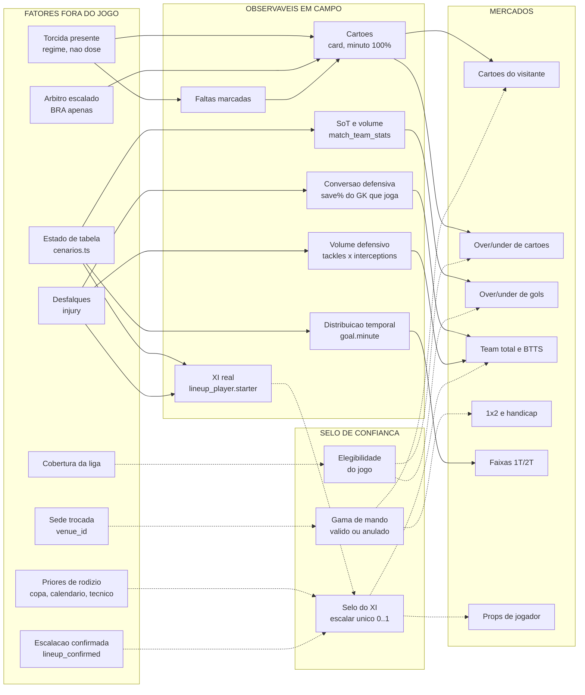

# Matriz de mecanismos: o que fora do jogo afeta dentro do jogo

> **TL;DR honesto.** Foram mapeados ~130 mecanismos candidatos. **Sobrevivem 17 linhas** na matriz principal, e mesmo entre elas só **duas** têm identificação causal de verdade (viés pró‑mandante do árbitro e as refutações medidas). A maior parte do que o dono listou — engenharia social, redes sociais, aniversário de clube, homenagem, aniversário de dirigente, patrocínio, rumor de transferência, conluio, cobrança de torcida, rivalidade entre jogadores, H2H individual — **está na seção 8 (não entra)**, por refutação medida, endogeneidade, veto legal ou ausência de dado. Isso não é falha do mapeamento: é o resultado. Sem odds, o que esta matriz entrega é **calibração e anti‑erro**, não *edge*.
>
> **Correção mais cara desta versão:** a hierarquia de observáveis da versão anterior (SoT r=0,519 como "conduíte‑rei") era em boa parte **identidade contábil** — gol conta como chute no alvo. Removendo o gol, a correlação cai para −0,008, idêntica à dos escanteios. O número preditivo real (SoT passado → gol deste jogo) é **r=0,066**. Todas as afirmações que se apoiavam em 0,519/0,459 foram rebaixadas.

---

## 1. Como usar este documento

Consulte-o em dois momentos: **(a) ao construir o grafo de features**, para saber qual fator externo aterrissa em qual coluna do banco e qual mercado; **(b) ao escrever o prompt**, para saber a ordem de leitura e, sobretudo, o que é **proibido cruzar** (seções 5, 6 e 7).

Este documento **não substitui** `docs/arquitetura/taxonomia-sinais.md`, que continua mandando sobre **camadas** (ESTIMAR / EXPLICAR / VALIDAR / INGESTÃO), sobre a **prioridade** de cada SIN e sobre os **vetos**. A taxonomia diz *quais sinais existem e quanto pesam*; esta matriz diz *por qual caminho causal eles chegam ao gramado, em que observável aterrissam, e com o que não podem ser somados*. Onde os dois divergirem, a taxonomia manda — com uma exceção declarada em §8 (SIN‑006/chuva, onde a taxonomia está desatualizada e há medição interna contrária).

Convenções: `[verificado]` = medido no banco deste repo ou lido em fonte primária citada; `[inferência]` = raciocínio sem medição. Nenhum tamanho de efeito foi inventado. Onde um mecanismo é plausível e não medido, está escrito "plausível, sem evidência" — isso é uma resposta válida.

---

## 2. A matriz principal

Ordenada por força da evidência. Escala:

- **A** — medido no banco deste repo **e** com identificação causal externa (ou é fato aritmético/estrutural).
- **B** — medido no banco, reproduzível, sem identificação causal.
- **C** — mecanismo verificado no código/estrutura, direção defensável, **magnitude não medida**.
- **D** — plausível, sem evidência.

`Dado`: `pronto` = coluna preenchida e utilizável; `prospectivo` = preenchida **também em jogos futuros** (o que a aposta exige); `timing` = boa em FT, vazia perto do apito por falta de sync agendado; `derivável`; `bloqueado`.

| # | Fator (fora) | Mecanismo (cadeia resumida) | Observável em campo | Mercado | Direção | Dado | Camada | Força |
|---|---|---|---|---|---|---|---|---|
| 1 | **Torcida presente → árbitro** (regime de público, não dose) | pressão sonora eleva a taxa de conversão falta→cartão **contra o visitante** | `card.team_id` × `match.home/away_team_id` → delta fora−casa | cartões do visitante, booking points | aumenta | `pronto` p/ backtest; **`timing`** (referee 16/196 em NS) | ESTIMAR | **A** |
| 2 | **Cobertura de dado da liga** | qual pipeline rodou decide quais observáveis existem | presença de `match_team_stats`, `referee_id`, `card`, `commentary` | todos (elegibilidade) | so_confiabilidade | `pronto` | CONFIABILIDADE | **A** |
| 3 | **xG real ausente** | sem medida direta de qualidade de chance, tudo vira proxy de volume | `match_team_stats.xg` = **0 de 3.072** | todos | so_confiabilidade | `bloqueado` | CONFIABILIDADE | **A** |
| 4 | **Sede trocada** (`match.venue_id` ≠ venue modal do mandante) | somem familiaridade + rotina + base de torcida ⇒ o γ estimado sobre a casa habitual não descreve este jogo | resultado vs γ esperado; ocupação atípica | 1x2, handicap (**anula** o γ) | so_confiabilidade | **`prospectivo`** (196/196 NS) | CONFIABILIDADE | **A** detecção / **D** magnitude |
| 5 | **Rigor do árbitro escalado — só Brasileirão** | gatilho de cartão do árbitro converte mais faltas em amarelo | cartões totais (`card`) | over/under de cartões | aumenta | `timing` | ESTIMAR | **B** |
| 6 | **Estado de intenção de tabela** (`cenarios.ts`: travado / administra / dead / push) | utilidade assimétrica ⇒ o time compra estrutura ou território; muda linha, ritmo, falta tática e XI | SoT total, faltas, share do 1ºT (`goal.minute`), rodízio no XI | over/under, 1x2, escanteios, cartões | **bidirecional** | `derivável` (`preMatchTable`, anti‑leak) | ESTIMAR **sob suspeita** (ver §5.4) | **B** cálculo / **D** efeito de campo |
| 7 | **Estrutura temporal do jogo** (urgência tardia) | quem perde aos 70' é obrigado a se lançar; falta tática aos 85' é a mais barata | `goal.minute` 4.274/4.274; `card.minute` 6.719/6.719 | `total_1t`, `total_2t`, faixas de gol, cartões tardios | redistribui | `pronto` (100%) | ESTIMAR condicional | **B** baseline / **D** efeito de stake |
| 8 | **Desfalque do goleiro titular** | é o único jogador cuja troca altera a conversão de **todo** o volume adversário | `lineup_player.saves` ÷ SoT sofrido, do goleiro **que vai jogar** | over, team_total do adversário, BTTS, handicap | aumenta | `pronto` (722 ocorrências pos 24) | ESTIMAR | **C** |
| 9 | **Desfalque de zagueiro (148) / volante (149)** | sai volume defensivo; **desarme e interceptação são ofícios separáveis** (r=0,129, N=3.072) e abrem buracos diferentes | `match_team_stats.tackles` / `.interceptions` (~97%) | **rota** de gol (grid por corredor), team_total do adversário | aumenta | `pronto` | ESTIMAR (rota, não total) | **C** |
| 10 | **Volume de ausências, medido em SHARE DE MINUTOS** (não em contagem) | qualidade média do XI cai ⇒ cai a probabilidade de vitória | rating/minutagem do XI (`lineup_player`) | 1x2, handicap, dupla chance | reduz | `pronto`; **`timing`** (feed prospectivo enche só perto do apito) | ESTIMAR | **C** |
| 11 | **Escalação confirmada** (`match.lineup_confirmed`) | o XI real colapsa a incerteza ⇒ **todos** os priores de rodízio expiram juntos | XI real, formação, roles | todos, via confiança | so_confiabilidade | ingerido e **ocioso**; true em 2/196 NS | CONFIABILIDADE (gate lógico) | **A** como restrição lógica |
| 12 | **Priores de rodízio** (eliminação de copa, lookahead doméstico, densidade, troca de técnico, retorno de lesão, minutos acumulados, `dead` com poupança) | mudam o **critério** de escalação ⇒ o XI derivado por inércia de minutagem perde validade | distância do XI à moda dos últimos 5 (`lineup_player.starter`) | nenhum direto; degradam props, setores, duplas | so_confiabilidade | `derivável` | CONFIABILIDADE — **insumos de UM selo** (§7) | **D** |
| 13 | **Lei do ex** (jogador contra ex‑clube) | motivação pessoal ⇒ ele **assume** a finalização | `lineup_player.shots_total` / `.shots_off_target` | props de **volume** de chute | redistribui | `derivável` parcial (intra‑janela) | ESTIMAR restrito | **C** volume / **D** nulo de precisão |
| 14 | **Suspensão / convocação / inelegibilidade** | é a **mesma ausência** com outro motivo (`injury.reason`) | — (direção vem da posição) | herda da posição | — | `pronto` (~800 + 77 + 80) | **higiene de pipeline, não fator** | **B** |
| 15 | **Desfalque de finalizador/criador** | perde volume e conversão do ausente | SoT do time | — | reduz — **JÁ CONTADO no λ** | `pronto` (1.437 CA) | **EXPLICAR, peso ZERO** | **C** |
| 16 | **Jogador "na bica"** (limiar−1 de amarelos) | evita a dividida de risco ⇒ menos falta dele, corredor mais permeável | `lineup_player.fouls` do jogador; acúmulo via `card` + `match.season_id` | cartões do jogador; marginal em transições | bidirecional | `derivável` (limiar por liga **não está no schema**) | plausível | **D** |
| 17 | **Rodada final simultânea** | placar de outro campo muda a intenção **dentro** do jogo | virada de momentum sem evento próprio (`match_trend`) | **variância**, não direção | so_confiabilidade | `derivável` (`match.date` + `match.time`) | CONFIABILIDADE | **D** |

### Ressalvas que fazem parte das linhas (não são rodapé)

- **Linha 1.** O delta bruto casa/fora está `[verificado]` no banco: PL **+0,333** (casa 1,87 vs fora 2,20; n=760), BRA **+0,267** (2,40 vs 2,67; n=562), CARA **+0,162** (n=74), FAC +0,048 (n=841, ingestão de cartões quebrada). A **atribuição ao árbitro** é `[inferência importada]` de PMC9261922 (3.898 jogos do top‑5 UEFA, 2020/21, 90,7% de portões fechados): sem público, casa 1,95 vs fora 1,99, t(3897)=−1,59 n.s., d=−0,03, BF01=15,13. Teste interno que falta e é barato: delta casa/fora **within‑árbitro** e condicionado a faltas cometidas. **Se o baseline de cartões já for split casa/fora, o +0,33 já está lá dentro — não somar.**
- **Linha 5.** O "~2×" de `docs/regras/arbitragem.md` **não se reproduz**. Após o shrink que o próprio doc prescreve (§3): PL — SD observada 0,359 vs SD de puro ruído 0,373 ⇒ SD verdadeira 0,000, confiabilidade **0,0%**; estabilidade entre 24/25 e 25/26 **r=−0,196** (total) e **r=−0,255** (amarelos), 17 pares. BRA — SD verdadeira 0,291, confiabilidade **30,2%** (37,3% só em amarelos), spread real ±2SD = 4,12 a 5,42 = **1,31×** em amarelos (1,26× no total). O alvo do P1 é o **Brasileirão**, não a Premier League. Status epistêmico correto para a PL: **não estabelecido**, não "refutado" — a designação de árbitro não é aleatória, então a SD de ruído está possivelmente inflada e o método é viciado na direção de encontrar zero. (`_probe-arbitro-shrink.ts`, `_probe-arbitro-amarelo.ts`)
- **Linha 7.** As faixas **não têm duração igual** — 31‑45 absorve os acréscimos do 1ºT e 76+ absorve todo o 90+. Normalizar por minuto real antes de calibrar. E o baseline (76+ = 24,5% dos gols, 34% dos cartões, 43% dos vermelhos) é **incondicional**: já contém toda a urgência tardia média. Medir a distribuição **condicional** ao estado de stake contra a dos jogos sem stake; a diferença é o efeito, nunca um multiplicador sobre a média que já os mistura.
- **Linha 8.** `[verificado]` que o reserva sofre +0,336 gol/jogo e faz **mais** defesas (3,323 vs 3,153), com save% caindo de 70,8% para 67,0% (~3,8 p.p.). O +0,336 é **TETO**, não estimativa: metade é volume (o XI inteiro rodou junto), metade é conversão. Só a segunda é o mecanismo do SIN‑011.
- **Linha 10.** A âncora externa (PMC12207164, *Monetising misfortune*) tem **dois** coeficientes; a versão anterior citou o errado. Para **indisponibilidade em dia de jogo** — que é o que o repo computa — o valor é **0,42–0,45 jogador ≈ −1 ponto**, não 1,45. É sobre **pontos**, não gols, e é observacional. Corrigir também `docs/regras/lesoes.md:23`.
- **Linha 13.** O abstract de Assanskiy 2022 estabelece "chutam mais" para futebolistas da PL `[verificado]`; o **nulo de precisão** é de **basquete** e a transferência para futebol é `[inferência]`. O efeito é condicionado (fora de casa; jogadores preteridos/dispensados) — condições que o repo não observa. Regra conservadora mantida: **mexe no denominador (tentativas), nunca no numerador (conversão)**.
- **Linha 15.** `evidence-crossings.ts:528-541` já remove os jogadores de `injury` do XI provável e recalcula o λ bottom‑up. **Repetir a narrativa "under porque o atacante está fora" é o erro nº1 da taxonomia cometido dentro do repo.**

---

## 3. Mapa fora → dentro

Só os caminhos que sobreviveram à auditoria. Linha tracejada = **gate de confiança** (não move probabilidade).



**Leitura do diagrama.** Só quatro fatores externos têm seta cheia (movem número): torcida/árbitro → cartões, estado de tabela → volume e tempo, desfalques → conversão defensiva e rota. Todo o resto entra por seta tracejada, isto é, **decide no que confiar**. E `O1 → O2` é mediação, não soma: falta é o canal por onde o árbitro age.

---

## 4. Cruzamentos que valem

Um cruzamento só é ouro se **duas partições independentes** (fontes de dado diferentes, erro não correlacionado) se **multiplicarem** sobre um observável compartilhado. Teste aplicado a cada par: *remova o fator A — o efeito de B sobre o observável permanece?* Se remover A encolhe B, é a mesma informação com dois nomes.

### 4.1 Viés pró‑mandante × visitante que precisa vencer → **cartões do visitante**
**Leitura.** Base × resíduo, num observável só. A **base** é a taxa de conversão falta→cartão contra o visitante, estruturalmente elevada por pressão de público `[verificado, 4 ligas + PMC9261922]`. O **resíduo** é o volume de faltas do visitante: quem precisa de 3 pontos sobe a linha e se recompõe em corrida — e a falta tática de recomposição é a mais frequente do jogo. Os dois vêm de fontes distintas (ambiente/árbitro vs tabela).
**Exemplo.** BRA, rodada 36: lanterna dentro do Z visitando um mandante de casa cheia. Mercado: **team cards do visitante / booking points**, não o total do jogo.
**Travas.** (a) Entra como **desvio em torno da média daquele árbitro/mando**, jamais como duas parcelas somadas. (b) Se o baseline já for split casa/fora, o +0,33 já está dentro. (c) Excluir FA Cup (referee 15%, 0,41 cartões/jogo = ingestão quebrada).
**Magnitude da interação:** `[inferência]` — não medida.

### 4.2 Goleiro que **vai jogar** × volume de chance clara do adversário → **over / team_total / BTTS**
**Leitura.** O goleiro é o único jogador cuja troca altera a conversão de *todo* o volume adversário. Volume alto × trava degradada é super‑aditivo.
**Furo que este par cavalga `[verificado por leitura de código]`:** `evidence-crossings.ts:186-215` (`fisicoDuel`) seleciona o goleiro por minutagem dos últimos 5 e **não consulta `injury` da partida‑alvo**, enquanto o bloco do XI (`:535-537`) filtra `!injuredIds.has(id)`. Quando o titular está fora hoje, o motor imprime o save% **dele** — o mecanismo que SIN‑011 aponta como o mais subprecificado está modelado **ao contrário**. O comentário em `:192-193` mostra que já corrigiram o bug vizinho ("o bug do Alisson"), mas aquela correção tratou minutagem season‑vs‑recente, não ausência na partida‑alvo.
**Correção obrigatória antes de usar (as três juntas):** (1) aplicar `injuredIds` à seleção do goleiro; (2) **ratear os gols sofridos por minutos jogados** — hoje `savePctOf` (`:203-210`) soma `ft_home`/`ft_away` do jogo inteiro para qualquer goleiro com minutos > 0, então o reserva que entra aos 80' num 0‑4 leva os 4 gols; (3) **encolhimento bayesiano** no save% do reserva, no espírito do `CONV_PRIOR_SOT`. Sem (2) e (3), a correção troca um veredito invertido por um ruidoso.
**Escolha do lado do volume:** SoT **ou** big_chances_created, nunca os dois (r=0,568 entre si; são o mesmo lance com filtro diferente).

### 4.3 Desarme × interceptação — **a única partição medida do banco**
`[verificado]` corr(tackles, interceptions) = **0,129** (N=3.072), contra posse×passes 0,882, goal_attempts×shots 0,814, ataques perigosos×ataques 0,681, SoT×chutes 0,663, escanteios×cruzamentos 0,658. São dois ofícios distintos — duelo no chão vs leitura de linha de passe.
**Uso.** Perder o **interceptador** libera a linha de passe (rival cria por dentro); perder o **desarmador** abre o corredor (rival cria por fora, e o grid de setores muda de lado). Hoje os dois saem como "volante desfalcado" e produzem o mesmo desconto.
**Escopo.** Efeito sobre **rota**, não sobre total. E a independência medida é **contemporânea entre colunas**, o que não implica independência **preditiva** entre estimadores — antes de usá‑las para particionar avaliadores, medir a correlação entre os **erros**, não entre as colunas.

### 4.4 Estado de intenção × **capacidade** (λ_SoT do time)
Motivação não vira gol sem capacidade. Time que precisa vencer com ataque abaixo da média produz mais posse, mais cruzamento e mais escanteio — canais que **não vazam para gol** — e ao mesmo tempo se expõe à transição. Resultado típico: over não paga, e o gol que sai é do adversário.
**Regra:** o stake só empurra over quando **os dois lados da conta fecham** — intenção **e** λ_SoT. Vale igual para `dead → over`: quem produz o gol é o lado **motivado**, então o over exige λ_SoT do motivado acima da liga.

### 4.5 Densidade de janela × dias de descanso — o padrão de construção correto
As duas ocupam **intervalos temporais disjuntos** da mesma sequência de `match.date` (a janela retrospectiva vs o gap final), com o motivo escrito no comentário do código: *"anti‑dupla‑contagem por construção"*. É o template a replicar em `oppFactor × defInjFactor` (§6.9).
**Ressalva que se mantém:** "não é duplicado" **não** implica "é preditivo" — a fadiga crua segue refutada (§8).

### 4.6 Gancho iminente × importância do próximo jogo × árbitro (BRA)
Único mecanismo de *timing* possível num repo sem feed de escalação provável: antecipa um desfalque determinístico com uma rodada de antecedência. `[verificado]` a matéria‑prima: 6.438 amarelos em 1.732 jogadores; 144 chegaram a exatamente 5 amarelos na temporada, 86 a 6, 74 a 7; o BRA gera ~9× mais suspensão por acúmulo que a PL (402 vs 45). `[plausível, sem evidência]` a reação comportamental — testável de graça com `lineup_player.fouls`.
**Dependência real:** o limiar de acúmulo **por liga não existe no schema**; precisa ser cadastrado por `league_code`.

### 4.7 ⚠️ Par rebaixado: propensão a falta × rigor do árbitro
A versão anterior tratava isto como análogo limpo de volume × conversão. **Não é.** `match_team_stats.free_kicks` e `lineup_player.fouls` registram infrações **marcadas**, não cometidas — e marcar é decisão do árbitro. Um árbitro de gatilho baixo infla os dois lados da conta, então parte da correlação medida `corr(faltas, cartões) = 0,372` (N=3.008) é o próprio árbitro aparecendo duas vezes. A circularidade denunciada em `arbitragem.md §3` não foi quebrada: foi movida um elo para trás.
**Para reabilitar:** residualizar a propensão a falta do time por efeitos fixos de árbitro (checar antes se há conectividade time×árbitro suficiente no BRA), **ou** usar um insumo de exposição que o árbitro não decide (duelos, transições sofridas). Enquanto isso, é um estimador único de cartões com um regressor contaminado.

---

## 5. Cruzamentos que ANULAM ou CONDICIONAM

### 5.1 `lineup_confirmed = true` **anula todos** os priores de rodízio
Eliminação de copa, lookahead, densidade, troca de técnico e poupança respondem à mesma pergunta — *quem entra em campo?*. Quando o XI real sai, a pergunta foi respondida por observação e os cinco **expiram juntos**. Manter qualquer um é afirmar incerteza já resolvida. `[verificado]` a coluna é escrita em `apps/api/src/db/sync-ingest.ts:114` e **não é lida por nenhum consumidor** — `grep` só a encontra em `_probe-contradominio.ts` e `_probe-noticia.ts`.
**Honestidade sobre o ganho:** o gate é uma restrição **lógica**, não uma estimativa — e **não é validável retrospectivamente**, porque em jogos FT ele é ~sempre true (PL 760/760). O benefício é anti‑erro; não prometa calibração medida.

### 5.2 Sede trocada **anula** o γ de mando (e o prêmio de cartões do visitante)
Interruptor, não parcela. Familiaridade, rotina e torcida são **componentes** do mesmo γ; aplicar "sede neutra" + "viagem longa" + "sem torcida" é contar a mesma anulação quatro vezes. `[verificado]` `venue_id` está em **196/196** jogos NS — é o único mecanismo prospectivo genuinamente limpo da matriz. Assinatura do fenômeno na base: Santos com ocupação média 91,1% e **desvio‑padrão de 61,4 p.p.** em 23 jogos (fisicamente impossível); Melbourne Cricket Ground e Britannia Stadium com 1‑2 jogos.

### 5.3 `chaseViable = false` e `undecided` **desligam a família de stakes inteira**
Gates, não fatores. Sem eles, todo time recebe rótulo extremo — o modo de falha está documentado em `prognosis-prompt.ts:1140-1148`: o lanterna com 9 pontos saía simultaneamente como "luta contra o rebaixamento" **e** "Libertadores ao alcance" no mesmo bloco. Aplicar o gate **e** somar um efeito próprio conta a mesma informação duas vezes.

### 5.4 Cenário enumerado **tem precedência** sobre veredito heurístico — e "administra → under" está sob suspeita
Quando `lib/cenarios.ts` diverge de `stakesFor()`, **o cenário manda**. Não é média, é escolha: um é enumeração exaustiva com acoplamento respeitado, o outro é regra de bolso. O par que o repo mais teme é `travado` vs `administra` — e confundi‑los **já inverteu uma leitura de under** (documentado no super‑prompt).

E a regra mais assertiva do prompt (`prognosis-prompt.ts:1408`: *"foi exatamente neste tipo de jogo que a leitura puramente estatística mais errou no histórico"*) **não tem N, não tem log e não tem backtest**. É recordação de fracassos salientes — isto é, seleção sobre o desfecho, exatamente o vício que esta matriz usa para descartar o folclore do aniversário de clube. **Rebaixada a hipótese sob suspeita:** não pode empurrar under sozinha. Teste barato: contar gols em jogos com `administers=true` / `drawSecuresStay=true` contra o baseline da **mesma liga‑temporada e da mesma faixa de rodada** (o controle por rodada é obrigatório).

### 5.5 Competência defensiva **inverte** o under do administrador
Querer segurar não é conseguir. Administrador com SoT concedido acima da média da liga não fecha o jogo: comprime a própria área, convida pressão e aumenta a exposição a bola parada. Acima da média da liga, o mesmo estado de tabela vira argumento de **over**.

### 5.6 Over **≠** BTTS — a regra de seleção de mercado mais barata da matriz
Over depende da **soma** dos λ; BTTS depende do **mínimo**. Teste, antes de escolher o mercado: *o mecanismo mexe em UM λ ou nos DOIS?*
- **Assimétrico** (lado morto, goleiro fora, administrador com defesa ruim): over **sim**, BTTS **não** — o elo fraco pode não marcar.
- **Simétrico** (both push, campo aberto dos dois lados): andam juntos.
É lógica de saída, não estimação — custo de implementação ~zero.

### 5.7 Portões fechados **anulariam** o viés pró‑mandante — mas **não há caso real**
`[verificado]` **zero** jogos de portão fechado na base. Os candidatos são lixo de dado: Fortaleza × Mirassol (2025‑08‑24) com `attendance=17` num estádio de 63.908; Sport × Bahia com 16; Nottingham Forest × Bournemouth com 29; Newcastle × Southampton (2024‑08‑17) com 52. **Um detector ingênuo de "estádio vazio" dispara justamente neles, invertendo o mando em jogos lotados.** Gate de sanidade obrigatório antes de qualquer feature de público: descartar ocupação fora de **[0,05; 1,05]** — há 43 jogos com razão impossível (máximos 3,24 BRA, 6,85 CARA, 8,88 FAC).

### 5.8 Lookahead **só existe** com stake baixo hoje
Poupança é escolha entre dois jogos. Com stake alto hoje, não há escolha — o efeito é **exatamente zero**, não atenuado. Condicional, nunca aditivo.

---

## 6. PROIBIDO cruzar (anti‑dupla‑contagem)

Formato de regra, para virar instrução de prompt. Cada item: **A + B = mesmo sinal**, com o motivo.

**6.1 — γ de mando + torcida + viés de árbitro + viagem + altitude + superfície.**
O mando é a **SOMA**; os demais são **PARTES** (decomposição de Pollard). O γ, estimado dos resultados históricos daquele time em casa, já absorve torcida média, viagem, altitude e gramado. **Regra: o mando entra UMA vez. MOD‑001 é dono do baseline; todo o resto só como desvio.** Exceção legítima: o **delta de cartões** casa/fora, porque γ é estimado sobre gols e não cobre aquele mercado — mas só se o baseline de cartões **não** for split.

**6.2 — Contagem agregada de desfalques + desfalque por posição.**
O agregado **É a soma** dos específicos. Escolher UM nível: agregado para mercado de resultado, decomposição por posição para mercado de total. Nunca os dois.

**6.3 — Lesionados + suspensos + convocados + inelegíveis.**
Mesma tabela `injury`, frequentemente a **mesma linha**. `injury.reason` é o **motivo**, não um mecanismo irmão; a direção vem sempre de `player.detailed_position_id`. O motivo só informa **relógio e severidade**.

**6.4 — λ já netado + narrativa de desfalque.**
Quando `evidence-crossings.ts:528-541` remove o ausente do XI e recalcula o λ, o fator vira **EXPLICAR com peso ZERO**. Ele existe para dizer *por que* o λ caiu, não para fazê‑lo cair de novo.

**6.5 — Profundidade de elenco + qualidade do substituto + share de minutos.**
As três dizem a mesma coisa ("a ausência vale menos que a contagem sugere") e foram desenhadas em lugares diferentes da matriz. Aplicar as três **zera** desfalques reais. **Regra: UMA operação — comparar a taxa/90 do ausente com a do promovido dentro do próprio λ** (o mapa `acc` do `expectativaPanel` já tem os dois). As outras duas viram verbalização, peso zero.

**6.6 — Média de cartões do árbitro + média de cartões do time.**
Cada média já contém a outra (a do árbitro inclui os times que apitou; a do time inclui os árbitros que o apitaram) e árbitros não migram entre ligas ⇒ inseparáveis por construção. Erro nº1 de `arbitragem.md §3`.

**6.7 — Árbitro + clássico + stake + defensor improvisado, como boosts somados em cartões.**
Cartões é **MEDIADO**, não aditivo: contexto → falta → conversão do árbitro → cartão. **Regra: cartão tem UM estimador**, com árbitro (encolhido, normalizado por `rate_ratio` dentro da liga‑temporada) e propensão a falta como fatores do **mesmo modelo**; clássico e stake apenas como resíduo **em torno** da média daquele árbitro.

**6.8 — Faltas cometidas por A + `free_kicks` a favor de B.**
Altamente redundante — mas **não é identidade**: na amostra citada, 5 de 10 linhas batem exato e 5 divergem (até 15 vs 19; e um caso, 11 vs 9, com faltas > free_kicks, que quebra a história causal). Redundância alta já basta para proibir as duas rotas. **Preferir `free_kicks` do adversário** (cobertura 98% vs ~35%).

**6.9 — `oppFactor` + `defInjFactor` (código, `evidence-crossings.ts:615`).**
`[verificado]` `conceded` (`:442`) e `oppDef` (`:461-465`) agregam sobre o **mesmo** conjunto e a **mesma janela** (todos os jogos do rival na temporada). Os jogos em que o defensor já estava fora **já estão** dentro do `concededAvg` que gera o `oppFactor`. Não é só contar duas vezes: é condicionar numa variável **pós‑tratamento**. Pior, o viés muda de sinal com o tempo de ausência — desfalque antigo recebe inflação máxima nos dois fatores, e desfalque de última hora (o único com informação nova) recebe a mesma coisa.
**Correções:** tornar as janelas disjuntas (oppFactor sobre jogos **sem** o ausente; defInjFactor só sobre a janela em que ele jogou), ou zerar `defInjFactor` quando a ausência já é madura. E **liberar o clamp inferior** para 0,92 — hoje `clamp(1 + share*0.4, 1, 1.12)` tem piso 1 e **só sabe inflar**, o mesmo defeito de direção que o bloco aéreo já corrigiu em 2026‑07‑03.

**6.10 — Cadeia multiplicativa completa: `oppFactor × fArq × fVen × defInjFactor × fSetor`.**
Quatro dos sete fatores medem a mesma permeabilidade do rival ou o mesmo mando. `fArq` deriva da posse, e bloco baixo é justamente quem cede volume; `fSetor` é uma **fatia** do que `oppFactor` agrega; `fVen` recaptura o mando que já está no λ de liga e no split casa/fora do briefing. No teto dos clamps: 1,25 × 1,12 × 1,25 × 1,15 ≈ **2,01×** sobre o xSoT de **cada** um dos onze — e o λ é a soma, então o erro não dilui.
**A mesma proibição vale para `xKp` (`:617`)**, que herda quatro fatores contaminados e nunca foi auditada. Corrigir só o `xSot` cria falsa impressão de saneamento.

**6.11 — Forma recente em três níveis: `fForma` (jogador) + bloco de forma do time + "técnico sob pressão".**
Três leituras da **mesma** sequência de partidas, correlação de erro ≈1, todas chegando ao mesmo prompt. **Regra: a forma pertence a UM nível — o de jogador (`fForma`)**, porque é o único que sobrevive a rodízio e desfalque. Os outros dois viram EXPLICAR, peso zero.

**6.12 — SoT + big chances + chutes de dentro + chutes totais + `goal_attempts`.**
Partições do mesmo total (`shots_total = on target + off target + blocked`; `insidebox + outsidebox = shots_total`), com colinearidade medida (SoT×bcc 0,568; `goal_attempts`×shots 0,814). **Escolher UM conduíte.** E a regra para o dia em que o add‑on de xG for comprado: **xG SUBSTITUI SoT e big chances, não soma** — é o momento de maior risco de dupla contagem do repo.

**6.13 — Escanteios / posse / ataques perigosos / cruzamentos no estimador de over/under.**
Proibição de **vazamento**, não de colinearidade: corr com gols totais = −0,008; +0,071 (posse×gols próprios); −0,001; −0,131 (N=1.488). Continuam válidos nos seus próprios mercados e como classificador de arquétipo.

**6.14 — Save% + gols sofridos + SoT concedido como três observáveis paralelos.**
São algebricamente ligados: save% = 1 − gols_sofridos/SoT_sofrido. "Gols sofridos vs liga" **já é** volume × conversão. **Regra: competência defensiva = SoT concedido (volume) × save% do goleiro que VAI JOGAR (conversão).** "Gols sofridos" sai como observável independente.

**6.15 — `_audit-total-bias` (N=56) como corroboração em mais de um lugar.**
É **UMA** amostra, invocada por quatro famílias para quatro explicações **rivais** do mesmo resíduo de 0,5 gol (stake de reta final, assimetria ataque/defesa no desconto de desfalque, cauda 76+, ausência de xG). Remova uma e o resíduo permanece ⇒ são rivais, não aditivas. Se alguém "corrigir" as quatro, o motor passa a **superestimar** em até 2 gols/jogo.
**Regra: o resíduo é um ORÇAMENTO a repartir, não uma confirmação a replicar.** Nenhuma família pode citá‑lo antes de medir sua fatia. E o rótulo honesto do número é **descritivo**, não `verificado` — ver §9.

**6.16 — Rumor + ausência efetiva; H2H de resultado + acoplamento de estilo; aniversário + attendance alto.**
Três casos do mesmo vício: o segundo termo **é** o primeiro observado melhor. Rumor perde toda a função quando o XI sai; H2H é qualidade relativa reescrita como propriedade do confronto (e o resíduo legítimo — acoplamento de estilo — já é lido pelo `arquetipoPanel`); jogo de homenagem enche o estádio, então flag e attendance são o mesmo evento.

---

## 7. A ordem de leitura

**A regra em uma frase:** *contexto para decidir **NO QUE CONFIAR** = sim; contexto para decidir **O QUE CONCLUIR** = não.*

Com uma condição que não é opcional: **o "de cima" entra como escalar tipado e como seleção de XI, nunca como prosa no topo do prompt.** O consumidor final é um prompt de LLM concatenado (`super-prognosis.ts` roda o `prognosis-prompt.ts`, fatia a PARTE 2 e acrescenta o digest do `evidence-crossings` e o bloco de disciplina — tudo no **mesmo texto**). Nesse consumidor, **"ler primeiro" é "pesar mais"**, e repetir um fato é somá‑lo. Se o contexto social abrir o dossiê em texto livre, ele não gateia: **enquadra**.

### 7.1 Arestas DURAS (B é ininteligível sem A) — todas internas a uma partição

| Aresta | Por quê |
|---|---|
| `preMatchTable` + bounds + `TIEBREAK` → `cenarios.ts` → estado de intenção | o estado não é observável, é derivado da enumeração |
| `chaseViable` / `undecided` → estado de intenção | sem o gate, o estado é literalmente falso |
| `injury` → XI provável → {setores, expectativa por jogador, duplas} | os blocos não existem sem a lista dos onze |
| `injury(GK)` → save% → veredito do `fisicoDuel` | hoje quebrada — e o resultado é veredito com sinal trocado |
| `referee` → conversão falta→cartão → cartões | mediação; o cartão é ininteligível sem quem converte |
| `venue_id` vs modal → γ de mando | se a sede mudou, o γ não descreve nada |

**Nenhuma aresta dura parte de engenharia social, rivalidade, mood, notícia, aniversário, patrocínio ou pressão de torcida.** Não é omissão — é o resultado do teste.

### 7.2 O único caminho legítimo "de cima para baixo": **um selo, um dono**

Sete priores convergem para **um escalar**:

```
{eliminação de copa, lookahead doméstico, densidade/descanso, troca de técnico,
 retorno de lesão, minutos acumulados, dead com poupança}
        │
        ▼
   SELO DE CONFIANÇA DO XI  ∈ [0,1]
   fórmula única: distância à moda dos últimos 5  +  estado de lineup_confirmed
   lineup_confirmed = true  ⇒  selo := 1  e os sete priores EXPIRAM juntos
        │
        ▼
   {setores, expectativa por jogador, duplas, props nomeadas}
```

**Regra dura: o desconto sobre o XI é aplicado UMA vez, pela causa mais forte presente.** Sete rótulos, um escalar. Cinco famílias descontando o mesmo XI não é conservadorismo — é **acúmulo de cautela**, o erro simétrico e igualmente destrutivo da dupla contagem de sinal.

### 7.3 O que roda em PARALELO

`STANDINGS ⟂ ELENCO(injury) ⟂ AMBIENTE(venue/referee) ⟂ CLIMA ⟂ CONTRA-DOMÍNIO(match_team_stats)`

Encontram‑se em **dois pontos apenas**: o selo do XI e a composição final de mercado. Encadeá‑las (ler a tabela para "entender" o desfalque, ler a crise para "entender" a tática) colapsa partições independentes — e é gratuito, porque nenhuma precisa da outra para ser lida.

### 7.4 As cinco fases

| Fase | O que roda | Saída |
|---|---|---|
| **0 — Elegibilidade** | liga e cobertura; gate de ocupação [0,05; 1,05]; `weather.type`; presença de `referee_id`, `match_team_stats`, `commentary` | quais mecanismos podem ser avaliados |
| **1 — Gates estruturais** | `chaseViable`, `undecided`, `cenarios.situacao` (precedência sobre `stakesFor`), `venue_id` vs modal | **um** estado de intenção por time; γ válido ou anulado |
| **2 — Selo e composição do XI** | `injury` (com `reason` separando motivo, sem recontar), `lineup_confirmed`, distância à moda, os sete priores como **insumos** | a lista dos onze + **um** escalar de confiança |
| **3 — Estimação (paralelo, cega à narrativa)** | λ bottom‑up sobre o XI da fase 2; duelos físicos; setores; distribuição temporal; **modelo único** de cartões | os números |
| **4 — Composição de mercado** | selo como **multiplicador de confiança** (jamais parcela); teste over‑vs‑BTTS; escolha de linha e margem pela variância | o bilhete |
| **5 — Narrativa (EXPLICAR), peso ZERO** | rivalidade, notícia citável com `fonte_url`/`data`/`severidade`, lei do ex como textura, H2H como verificação de consistência | o *porquê* auditável |

**O firewall (fase 5 por último, não por elegância):** o número é **congelado** antes de a narrativa ser gerada, e a narrativa recebe o número como dado. Quant‑first (MOD‑004) manda concluir pelo número — mas um frame narrativo estabelecido antes faz toda observação seguinte ser lida para confirmá‑lo. É o gate `lineup_confirmed` que impede o frame de sobreviver à evidência que deveria substituí‑lo, que é o mecanismo exato da falácia narrativa.

### 7.5 Inversão de qualidade — o argumento que fecha

A camada "de cima" é a **menos** evidenciada do repo: SIN‑003 vetado por lei; SIN‑001 endógeno com r≈0,19 e seta causal predominando no sentido inverso; SIN‑005 folclore; SIN‑002 diluído na elite; rivalidade não representável (`rivals` não ingerido); técnico **indetectável** (`coach` = 0 linhas, `lineup.coach_id` 0/3.072). A camada "de baixo" (tabela, desfalque, tática) é a mais evidenciada. **Ler de cima para gatear é seguro justamente porque nada lá em cima tem permissão de concluir.**

---

## 8. O que NÃO entra na matriz, e por quê

Um parágrafo por item, para que não sejam re‑propostos.

**Mood / comentários em redes sociais (SIN‑003) — VETADO, nem narrativa agregada.** Três bloqueios independentes, o primeiro terminal: inferir estado emocional de indivíduo identificado é tratamento de dado pessoal sensível sem base legal (LGPD/ANPD + EU AI Act) — a proibição não depende de o sinal funcionar; o proxy é refutado (sentimento de Twitter na PL ≈50% de acurácia contra baseline de odds de 65,57%); e o que se mede é a comunicação da assessoria, não o estado do jogador. **Não criar coluna no schema.** O único escape é **citar** um post específico como evidência com `fonte_url`/`data`/`severidade`, peso ZERO. Regra de bolso da fronteira: *se a evidência puder ser reduzida a um número que entra em conta, ela cruzou a linha.* Nota necessária para não ser contornado por engano: `team.twitterUsername` **existe** no schema (`leagues.ts:62`, @feature SIN‑022) — é conta **institucional de clube**, portanto do lado permitido (citar fato público de fonte oficial), nunca do lado vetado.

**Aniversário de clube / jogo‑homenagem (SIN‑005) — DESCARTAR, folclore.** Morre por viés de sobrevivência: a data acontece todo ano e a homenagem em dezenas de jogos por temporada; quando o time ganha, a coincidência vira história contada e repetida; quando perde — o caso muito mais frequente — ninguém narra. **O denominador é invisível.** Armadilha concreta: seria **fácil** computar um flag `is_anniversary` a partir de `match.date`, e a facilidade é exatamente o risco — produziria um número de aparência rigorosa sobre um fenômeno sem mecanismo. Só `is_birthday` / `tribute_context` como rótulos narrativos. E a lei do ex foi formalmente **cedida à SIN‑007**: se reentrar por SIN‑005 como "ocasião especial", o mesmo jogador é contado duas vezes.

**Aniversário do presidente / dirigente — DESCARTAR, vazio.** Não consigo escrever nem **um** passo entre a data de nascimento de alguém que não joga, não escala e não está no gramado e qualquer mudança em posse, chute ou falta. Não é fraco: é vazio. É o caso extremo que mostra o critério funcionando. Criar coluna ainda acrescentaria data de nascimento de pessoa física identificada, sem finalidade legítima.

**Patrocínio novo / interesses comerciais do clube (SIN‑002) — DESCARTAR.** A cadeia quebra no primeiro elo e não precisa de estudo: patrocínio é contrato de **temporada**, e um fator constante ao longo da temporada não pode explicar variação **entre partidas** — e o modelo é por partida. Dinheiro novo compra jogadores em janela futura. E não há canal pelo qual a marca na camisa mude o comportamento dos onze. Toda motivação com mecanismo verificável já é capturada por SIN‑010 (stakes matemáticos). Contraste instrutivo: existem `tv_station` e `match_tv_station` — o repo **tem** dado comercial, de mídia, e mesmo esse não tem mecanismo estabelecido até o campo.

**Chuva como viés de under (SIN‑006) — REFUTADO com dado próprio.** `[verificado, controlado por liga]` BRA: com chuva 2,64 gols e 48,7% de over 2.5 (n=298) vs sem chuva 2,47 e 45,8% (n=264) — chuva tem **mais** gols. PL: 2,86 vs 2,83, plano. Por descrição: `light rain` 2,81 (n=420), `moderate rain` 2,88 (n=213), `sky is clear` 2,66 (n=153), `clear sky` 2,52 (n=73) — céu limpo tem **menos** gol que chuva. Única nuance a favor da tese: `heavy intensity rain` 2,61, mas n=38 é pequeno demais para cravar. **Divergência declarada:** `taxonomia-sinais.md:26` ainda diz "Chuva forte → under". Aqui a matriz diverge do canon com medição; a taxonomia deveria ser atualizada, possivelmente preservando o caso de chuva **forte**, que a amostra não resolve.

**Fadiga crua ("jogou há 3 dias → menos gols") — REFUTADO.** A literatura reunida pelo repo quebra o elo do meio: congestionamento sem efeito em distância percorrida nem em indicadores técnicos (PMC7846542); fadiga subjetiva não acumula monotonicamente na EPL (PMC12244382). E o veredito interno de SIN‑008 é que a versão crua é **o efeito casa/fora disfarçado** — somar um ajuste de fadiga a um ajuste de mando conta o mesmo fenômeno duas vezes, justamente onde ele é mais espúrio. **O que sobrevive é outra rota, com atraso:** carga sem recuperação → mais lesão muscular → elenco reduzido nas rodadas **seguintes** (PubMed 30442720: +303 player‑days perdidos e +2,1 lesões graves por temporada sem winter break, pior entre janeiro e março). A fadiga não muda o jogo de hoje; muda quem estará disponível daqui a semanas. **E o prior morre quando a ausência vira linha em `injury`.**

**Ocupação do estádio como dose‑resposta — REFUTADO onde é testável.** `[verificado]` O teste decisivo é o Brasileirão, única liga com variância real (ocupação média 0,589; 194/469 jogos abaixo de 50%): por faixa (<35% / 35‑55% / 55‑75% / ≥75%; n=107/113/108/133), delta de cartões 0,36/0,25/0,36/0,25 — **plano**; vitória do mandante 0,467/0,549/0,509/0,496 — **plano**. Na PL o gradiente aparente existe mas a liga é saturada (0,982 de média, só 14 jogos abaixo de 90%): ali ocupação é proxy de **clube grande**, isto é, força de elenco disfarçada de torcida. E a literatura de referência é **binária** e explicitamente não testa efeitos graduados. O efeito da torcida é de **regime**, não de dosagem. Some‑se: **`attendance` é 0 de 196 jogos NS** — no instante da aposta a coluna não existe.

**Temperatura — REFUTADO por confundimento de liga (e registrado como aviso de método).** Sem controlar liga, parece o fator mais forte de todos: <5 °C = 3,38 gols (n=96) até ≥27 °C = 2,58 (n=286), gradiente monotônico de 0,8 gol. Controlando por liga, encolhe e **inverte**: PL <5 °C 3,06 → 20‑27 2,51 (gradiente 0,55, coincidente com o calendário congestionado de dezembro‑janeiro); BRA 12‑20 2,47 / 20‑27 2,54 / ≥27 2,61 — direção **contrária**. É PL‑inverno contra Brasil‑verão. **Corolário que vale para toda a matriz: nenhum número calculado sobre o pool das 4 ligas é confiável.**

**Rigor do árbitro na Premier League — NÃO ESTABELECIDO.** Ver §2, linha 5. Não é refutação do método de SIN‑009: é calibração do tamanho e mudança de alvo (BRA, não PL). E o teste não separa "não há efeito" de "efeito mascarado pela estrutura de designação".

**Conflitos de elenco / racha de vestiário (SIN‑001) — ENDÓGENO.** Três frentes: o elo coesão↔desempenho colapsa em profissionais (r≈0,19 vs 0,43 em recreativos; team‑building em profissionais 0,40 IC[−0,02;0,83], não significativo); a causalidade é bidirecional **com predomínio desempenho→coesão** (times que vencem parecem unidos porque venceram); e não há feed pré‑jogo — quando o conflito vaza para a imprensa já está na odd. O racha é sintoma da má fase que a forma já contém.

**New manager bounce (SIN‑004) — REFUTADO.** Regressão à média medida a partir de um ponto escolhido pelo próprio extremo: trocam o técnico no vale de uma sequência ruim, e sequência ruim extrema contém azar que não persiste por definição. O bruto (+41% PPG na PL) vem com viés de seleção declarado pela própria fonte. Uso legítimo do técnico: **redutor de confiança** quando a amostra sob o comando atual é curta — nunca termo aditivo. **E hoje é indetectável:** `coach` = 0 linhas, `lineup.coach_id` e `coach_name` 0/3.072 nas 4 ligas; a query "times com mais de um técnico na mesma temporada" retorna vazio. Classificação correta: `precisa_ingestao` (lacuna de sync — a entidade Coach existe na SportMonks), **não** `bloqueado`.

**Ressaca de eliminação (perna emocional) — ENDÓGENA.** Quem é eliminado é, em média, o time pior ou o que já vinha mal; a queda seguinte é continuação da má fase. A eliminação também **libera** calendário, efeito de sinal oposto e tamanho comparável. E não há contrafactual (o mesmo time, mesmo desgaste, que **avançou**). Sobrevive apenas a **perna estrutural**: o critério de escalação mudou de regime ⇒ desconto de confiança sobre o XI (linha 12 da matriz).

**Rumor de transferência — DESCARTAR por redundância.** A única cadeia com mecanismo é "o clube poupa o ativo negociado ⇒ ele não joga" — e isso aparece **de graça** no XI confirmado. O rumor só tem valor **antes** de o XI sair; depois, ingerir rumor é pagar caro (esforço G em W‑017, com auth, job de matching e canal de alerta) por um dado que `lineup` já entregou. E o próprio W‑017 registra que rumor "frequentemente é falso/inflado".

**"Time A não se esforça contra B para não ajudar C" — DESCARTAR.** Quatro quebras: quem joga são profissionais com bônus por vitória e vitrine (o suposto benefício é do torcedor de A, não do jogador); não‑empenho detectável destrói carreira; "não se esforçar" é indistinguível de "jogar mal" e de "poupar titulares"; e o fenômeno real na vizinhança é **rodízio**, que é decisão pública e visível na escalação. A pergunta legítima por trás da intuição ("este time tem o que buscar?") **já tem resposta calculada** em `lib/cenarios.ts` e `lib/ultrapassagem.ts`. Nota dura para quem for ingerir `rivals`: a ingestão torna a relação **representável** sem tornar o efeito **identificável** — o gargalo é contrafactual, não de dado.

**Cobrança / protesto de torcida — ENDÓGENA.** Termômetro atrasado da sequência de resultados que o modelo já lê da fonte primária, com defasagem (o protesto chega **depois** dos resultados). O proxy disponível (queda de público) é o mesmo dado de ocupação já refutado. E a assinatura proposta ("posse alta + SoT baixo") tem no mínimo quatro causas concorrentes — adversário em bloco baixo, time à frente administrando, adversário inferior que se fecha, e o próprio mecanismo de stakes — então **não é diagnóstica**.

**Clássico → under (o mito) — DESCARTAR.** SIN‑007 já classifica sob mito. O único efeito pró‑under defensável é fragmentação, que é **subproduto** do mecanismo de cartões — contar "clássico → mais cartões" e depois "clássico → under" fatura a mesma cadeia física duas vezes. Precedente metodológico direto: SIN‑006 tinha intuição de under igualmente óbvia e foi medida e refutada aqui.

**H2H de resultado — ENDÓGENO.** Qualidade relativa acumulada reescrita como propriedade do confronto, com amostra menor e mando não corrigido (o mando alterna entre encontros). O uso legítimo já está implementado e travado no super‑prompt: **textura**, dizendo se **confirma ou contraria** a forma atual. O resíduo legítimo (acoplamento de estilo) já é lido pelo `arquetipoPanel` pelo lado certo — estilo **atual**, não placar antigo. **H2H entre jogadores** é a mesma coisa com n uma ordem de grandeza menor: descartar.

**Altitude — INERTE para as nossas ligas.** O efeito é real e forte na literatura CONMEBOL, mas não existe coluna de elevação em `venue`, Inglaterra é essencialmente nível do mar, o Brasileirão tem variação modesta e competições continentais não estão ingeridas. Ingerir hoje criaria uma coluna quase constante.

**Superfície do gramado — VARIÂNCIA MORTA.** 132 venues `grass`, **2** `artificial turf` (com 1 jogo FT cada, ambos de fase inicial da FA Cup), 5 null — e os nulls incluem Beira‑Rio (28 jogos) e Alfredo Jaconi (19). Refutado por indisponibilidade de variância, não por evidência contrária. Nota de schema: o comentário em `leagues.ts:79` declara `"artificial"`, mas o valor gravado é `"artificial turf"` — corrigir o comentário.

**Horário do jogo — ENDÓGENO.** O caminho causal real é seleção pela emissora: o slot nobre é escolhido *porque* é o jogo grande. Amplitude pequena (~0,27 gol na PL, ~0,26 no BRA) e sem padrão monotônico. E cruzá‑lo com temperatura ou janela sazonal é contar o **calendário** duas vezes.

**Volta decidida no agregado (mata‑mata) — MAPEADO POR COMPLETUDE, sem utilidade.** `match.leg` e `match.aggregateId` existem e o `sync-cup.ts` os popula, mas FA Cup é jogo único, Brasileirão é pontos corridos e Copa do Brasil não está ingerida — sobram apenas eventuais semifinais em duas mãos da Carabao. É, mecanicamente, o **mesmo** mecanismo de "empate basta" com a linha vindo do agregado.

---

## 9. Buracos conhecidos

### 9.1 Fator com mecanismo, sem observável mensurável
- **Altura da linha defensiva.** O proxy é `lineup_player.offsides_provoked`, com **1.642 de 64.266 linhas (2,6%)** — e `null` significa "zero **ou** não jogou", então é impossível distinguir zagueiro que não armou nada de zagueiro que não entrou. Sem poder estatístico. Fallback declarado: SoT total abaixo do λ do confronto + share do 1ºT.
- **Tempo de bola rolando.** Não existe coluna; só proxy por número de interrupções.
- **Rivalidade.** Nenhuma entidade no schema. `rivals` é unlock **gratuito** não ingerido; distância entre estádios (`venue` lat/long, 139/139) captura só derby local.
- **Técnico.** `coach` = 0 linhas. Consequência silenciosa: os blocos de estilo (arquétipo, setores, bola parada) **agregam jogos de comandos diferentes sem sinalizar**.

### 9.2 Observável com dado, mas vazio quando a aposta acontece
Este é o furo sistemático da versão anterior: cobertura foi medida em jogos **FT** e carimbada como "pronto", mas a aposta é em jogo **NS**.

| Coluna | FT | NS (196 jogos) |
|---|---|---|
| `match.attendance` | 1.373/2.237 (61%) | **0 (0%)** |
| `match.referee_id` | 1.525/2.237 (68%) | **16 (8%)** |
| `weather` | 1.487 | **2 (1%)** |
| `lineup_confirmed = true` | PL 760/760 | **2 (1%)** |
| `injury` | 5,78/jogo | 1,03/jogo **na média** — mas **9,67/jogo a 0‑2 dias** do apito e 8,29 a 3‑7 dias |
| `match.venue_id` | 1.488/2.237 (66%) | **196 (100%)** |

**A linha do `injury` corrige um erro que circulava:** o feed de desfalque **é** prospectivo e enche conforme a partida se aproxima; o "10× pior" era artefato de calcular média incluindo 150 fixtures a mais de um mês de distância. Isso também derruba a suspeita de que a lista fosse backfill derivada do lineup.

**Causa raiz única e já nomeada:** `db:sync` é script **manual, sem cron nem trigger**. Árbitro e escalação chegam dias/horas antes do apito e ninguém está lá para buscá‑los. **Sync agendado perto do jogo é UMA tarefa de engenharia que destrava quatro famílias de uma vez** — e é o gargalo real, não a ingestão de `rivals` nem de `coach`.

Outras armadilhas de dado: `weather.type` tem 850 `actual` e 689 `forecast`, e as medições agregaram os dois — para uso pré‑jogo, só `forecast` vale. `standing` **não tem coluna de rodada nem de data** e é deduplicado por `(seasonId, teamId)`: é estado atual, sobrescrito a cada sync. **Só pode ser lido para a CONTAGEM de vagas por zona**; tudo que depende de posição/pontos numa data passa por `preMatchTable()`.

### 9.3 Bugs de código que corrompem o λ (corrigir antes de qualquer backtest)
1. **Fan‑out no carregamento de gols** (`evidence-crossings.ts:71-76`): o `left join commentary` não é deduplicado. `[verificado]` 4.274 gols viram **4.521 linhas (+5,8%)**; 212 gols casam com 2+ linhas (um chega a 8). Como `golsBy` faz `cur.g += 1` por **linha** (`:517`), infla `conv` por jogador, `ligaConv` (`:432`), `ligaGoals` (`:178`) e `teamGols` (`:525`). E a inflação não é uniforme — pega mais quem marcou em minuto movimentado.
2. **Filtro de gol contra morto** (`:178`, `:432`, `:515`): o código compara com `"own-goal"`; o valor gravado é **`"own"`** (confirmado em `sync-ingest.ts:49`, `sync-sportmonks.ts:67`, `sync-old-season.ts:33` e no schema). `[verificado]` `goal.type` ∈ {normal 3.863, penalty 287, own 124} — a string `"own-goal"` não existe na base. Os 124 gols contra entram em `ligaGoals` (abaixa `ligaSavePct` ⇒ enviesa o veredito do goleiro para "trava", isto é, para under), em `ligaConv` e em `golsBy`, onde um zagueiro **adversário** recebe gol creditado ao time analisado.
3. **Pênalti dentro da conversão** (`:547`): `conv` usa `g.g`, que inclui pênalti (~0,78 de conversão contra ~0,30 em jogo corrido), aplicado a **todo** o volume do jogador. `cur.p` (`:516`) já conta pênaltis à parte — a correção é de uma linha.

**Nota de honestidade:** os bugs 1 e 2 empurram em **direções opostas** (fan‑out infla conversão ⇒ over; own‑goal abaixa `ligaSavePct` ⇒ under no veredito do goleiro). Não atribuo a eles o viés de total medido. O que se pode afirmar é que o `_audit-total-bias` rodou sobre um motor com dois defeitos aritméticos de sinal oposto, o que **enfraquece qualquer calibração feita em cima dele**.

### 9.4 O resíduo N=56 — por que ele não decide nada hoje
`_audit-total-bias.ts` mede total real 3,02 vs projetado 2,50, 64% acima. **Não é** evidência quantitativa da família de stakes, por quatro motivos:
- **Composição**: 50 dos 56 são rodada ≥35 (PL r35‑38 com 10 jogos cada + BRA r38), contra um "controle" de **6** jogos. O próprio script avisa que rodada final tem mais gol por natureza (BRA +0,48 — praticamente o "viés" inteiro).
- **Temporalidade**: 56 de 56 prognósticos gerados **depois** do dia do jogo, numa janela de 3 semanas. É rodagem retrospectiva em lote, não previsão.
- **Ajuste com resultado na mão**: `_coorte-congelada.ts` documenta que o prompt foi ajustado entre rodadas com os placares conhecidos — *"5/5 nessas condições é o resultado esperado de ajustar até passar"*.
- **Autosseleção**: a amostra são as partidas que por acaso têm linha em `match_prognosis`, e o `distinct on (match_id) order by run_at desc` mistura versões de prompt.

**Retratação importante, para não acusar injustamente: o motor NÃO vaza.** `evidence-crossings.ts:59-63` aplica `cutoff = target.date` e `status='FT' and date < cutoff`; `preMatchTable()` recomputa a tabela de `ft_home`/`ft_away` + `date` em vez de ler o `standing` final. O defeito é de **seleção e ajuste**, não de vazamento.

**Consequência:** o cruzamento antes eleito "de maior retorno" — particionar os mesmos 56 jogos em hot/💤 — **não sobrevive**: herda os quatro vieses e produz dois baldes de ~28 que nem são intercambiáveis (rodadas e ligas diferentes).

### 9.5 Mecanismos plausíveis sem evidência (registrados para não serem redescobertos como novidade)
Cauda temporal condicionada a stake; bimodalidade de gols em `drawSecuresStay=true` (testável com `goal.minute` + `match_trend`, nunca rodado); curva de momentum pós‑2‑0 para `via='saldo'`; reação comportamental do jogador "na bica"; magnitude do encolhimento do γ em sede trocada; efeito de campo de `situacao='travado'` (o repo trata como estabelecido e é pura dedução de incentivo — é o teste mais barato e mais óbvio que a família nunca fez); ausência de capitão → cartões (peso sugerido: ZERO); vento → escanteios (medido 5,16 → 4,76, mas ~1,6 SE, p≈0,11 — **não significativo**, e as duas ligas discordam no sinal dos gols).

---

## 10. Como isso seria testado

### 10.1 O princípio, antes do desenho
**Nenhuma linha desta matriz vira ESTIMAR sem backtest.** E, sem closing line (SIN‑012 bloqueado), nem o backtest produz *edge* — produz **calibração**. Um conduíte verificado não é um preditor validado. Registre a diferença em toda saída.

### 10.2 O A/B de ordenação na coorte congelada — o que ele PODE e o que NÃO PODE decidir
**Não decide a questão**, e é preciso dizer isso antes de rodar:
1. **n=10.** Log‑loss e Brier sobre ~10 desfechos binários por mercado — o erro‑padrão engole qualquer delta de ordenação.
2. **`lineup_confirmed` é ~sempre true em FT.** O gate mestre — exatamente o mecanismo que torna a ordem "de cima" segura — **não pode disparar retrospectivamente**. Um backtest na coorte testa tudo *exceto* o que mais importa.

**O que ele PODE entregar: verificação de mecanismo.** E é um **diff within‑engine** — mesmo λ, mesmos bugs nos dois braços, que em larga medida se cancelam — então **não é preciso corrigir os bugs antes** deste teste específico.

**Nota operacional:** `apps/api/scripts/output/coorte-PL-2025-2026.json` **ainda não existe**; `_coorte-congelada.ts` grava lá mas nunca foi rodado. Rodar primeiro (`bun run scripts/_coorte-congelada.ts` em `apps/api`).

**Braços** (mesmo motor, mesma versão de prompt; muda só a ordem e a tipagem do contexto):
- **A (topo‑narrativo)** — contexto humano/social primeiro, em prosa, no topo do dossiê; tática depois.
- **B (gate tipado)** — fases 0→4 de §7.4: contexto como selo escalar + seleção de XI + vetos; narrativa por último, com o número congelado.

**Congelar antes de rodar:** os 10 IDs, o hash da versão do prompt, as linhas de cada mercado e o critério de leitura.

**Métricas** — por mercado, linha fixa: `over_under` (2.5), `btts`, `1x2`, `total_1t`, cartões. **Log‑loss** e **Brier**, com Brier decomposto em *reliability* (calibração) + *resolution* (discriminação), com IC. **Não usar acerto de `best_bet`** — reflete política de seleção, não calibração.

**A saída real com n=10 é o conjunto de divergência**: isolar os ~2‑3 jogos em que os braços produziram gates diferentes (XI rodado, sede trocada, estado de intenção divergente) e apresentá‑los como **casos**:
- O braço B **absteve‑se de direção** ou **alargou variância** onde a teoria prevê?
- O braço A produziu conclusão **direcional** a partir de um fator `so_confiabilidade`?
- O braço A repetiu o mesmo fato em dois blocos (dupla contagem editorial)?

Chamar isso de calibração seria repetir o vício do N=56.

### 10.3 Caminho de expansão (o que de fato dá veredito)
1. Coorte com critério **congelado antes**, muito mais jogos, rodadas espalhadas (o padrão de `_coorte-congelada.ts`: rodadas 10/15/20/25/30, 2 jogos por rodada em ordem alfabética do mandante), em liga não usada para calibrar nada.
2. `run_at` **anterior ao apito** — exige o sync agendado de §9.2.
3. Para exercitar o gate mestre, **reconstruir o estado de informação pré‑apito**: mascarar `lineup_confirmed` e usar snapshot prospectivo de `injury`. É o único mundo em que o gate tem valor "off".

### 10.4 Testes baratos, todos com dado já no banco, nenhum rodado
| # | Teste | Por que vale |
|---|---|---|
| 1 | Gols e cartões em `situacao='travado'` vs baseline da mesma liga‑rodada | testa uma regra que o repo já trata como estabelecida e nunca mediu |
| 2 | Distância do XI à moda dos 5 anteriores, antes vs depois de `titleClinched` | **o próprio time é controle** — resolve a seleção adversa |
| 3 | Save% titular vs reserva, **dentro do time**, com gols rateados por minutos e SoT sofrido como offset | separa volume de conversão; hoje só existe o teto (+0,336) |
| 4 | Delta de cartões casa/fora **within‑árbitro**, condicionado a faltas | separa canal de conversão (árbitro) de canal de volume (visitante) |
| 5 | Faltas/90 do jogador em jogos com limiar−1 vs demais | única hipótese comportamental testável de graça |
| 6 | Variação do XI pós‑eliminação vs pós‑avanço, mesmo time | dá magnitude ao selo de confiança, hoje asserido |
| 7 | Correlação **preditiva** (janela anterior → gol deste jogo) para todos os observáveis, **por liga** | substitui a hierarquia contaminada; teto esperado ~0,3, não 1,0 |

### 10.5 Ordem de execução recomendada
1. **Os dois bugs aritméticos** (§9.3, itens 1 e 2) — enquanto existirem, todo backtest mede o motor, não o futebol.
2. **Sync agendado perto do apito** — converte "pronto para medir" em "pronto para apostar" em quatro famílias.
3. **Correção do goleiro no `fisicoDuel`**, com rateio por minutos e encolhimento juntos.
4. **Ligar o gate `lineup_confirmed`** como selo único do XI.
5. **Detector de sede trocada** — pode ir para produção hoje: único mecanismo prospectivo com 100% de cobertura em jogos futuros.
6. Só então os pares de árbitro no Brasileirão, com normalização por `rate_ratio` dentro da liga‑temporada e média **sempre encolhida**.

---

## Apêndice: reprodutibilidade

Sondas versionadas em `apps/api/scripts/` (rodar com `bun run scripts/<arquivo>.ts` a partir de `apps/api`):
`_probe-ambiente.ts`, `_probe-ambiente2.ts` (cortes dentro da liga), `_probe-ambiente3.ts` (controle de confundidores), `_probe-arbitro-shrink.ts` e `_probe-arbitro-amarelo.ts` (decomposição sinal/ruído), `_probe-contradominio.ts` / `2` / `3` (cobertura e correlações), `_probe-audit.ts` (cobertura FT vs NS), `_coorte-congelada.ts` (coorte com critério congelado), `_audit-total-bias.ts` (descritivo — ver §9.4).

**Regra permanente:** todo número desta matriz deve ser refeito **por liga** antes de virar calibração. Os baselines diferem demais (cartões BRA 5,05 vs PL 4,07; gols de pênalti BRA 0,228/j vs PL 0,166/j vs FAC 0,021/j), e a FA Cup deve ser **excluída** de qualquer backtest de cartões, árbitro ou ambiente (referee 15%, attendance 10%, 0,41 cartões/jogo = ingestão quebrada).
