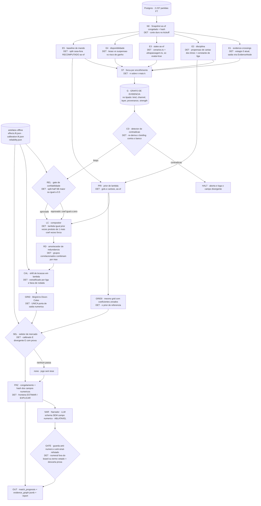

# Grafo agêntico de prognóstico — desenho final

> Data: 2026-07-21 · Escopo: arquitetura do motor de prognóstico (`super-prognosis.ts`, `prognosis-prompt.ts`, `evidence-crossings.ts`)
> Método: 4 eixos de evidência externa + 4 inventários de dado no banco + 6 arquiteturas concorrentes, cada uma auditada por 3 lentes adversariais (taxonomia, dado, custo).

---

## 1. TL;DR + recomendação cravada

**Construa um grafo com MENOS LLM do que o motor de hoje, não mais.** A evidência externa é convergente e o dado interno confirma: multi-agente que DEBATE, VOTA ou ARBITRA probabilidade não melhora calibração e frequentemente piora; o único ganho robusto vem de extratores determinísticos + agregação em código + calibração pós-hoc determinística. O motor vivo hoje **viola a doutrina quant-first do próprio repo** — o LLM emite `xg`, `total`, `over25_prob`, `btts_prob`, `one_x_two`, `mercados[].prob` e `best_bet.probability` direto do JSON Schema (`apps/api/scripts/super-prognosis.ts:106-140`, `:165-310`) enquanto `marketProbs` (`apps/api/scripts/prognosis-prompt.ts:735`) já calcula o board inteiro, coerente por construção, e é jogado no prompt só para o modelo sobrescrever (`prognosis-prompt.ts:1923`). O desenho recomendado é o **PCN-mínimo**: um grafo de evidência tipada, 100% determinístico no caminho do número, com **UMA chamada de LLM** (narrador, ablatável a zero sem o produto perder uma linha do board), coeficiente com **default ZERO** para todo sinal, e um **gate de confiabilidade (split-half) antes mesmo do backtest**. **NÃO construa**: painel de promotores/tribunal, fan-out de lentes LLM sobre `commentary`, agentes que votam ou escolhem mercado, calibração Platt/extremização (o defeito medido é de locação, não de compressão), e nada de rede social / aniversário / patrocínio. **Primeira fatia (Fase 1) é zero-LLM e cabe numa semana**: extrair `lib/grid.ts`, pontuar a coorte congelada de 10 jogos, e fechar o loop de calibração em **cartões** — o único mercado cujo desfecho está no banco e que portanto pode ser medido **sem odds**.

---

## 2. A evidência que governa o desenho

### 2.1 Externa — o que proíbe e o que autoriza

| Achado | Fonte | Consequência de desenho |
|---|---|---|
| [verificado] LLM **escolhendo** o forecast (best-of-k) é o **pior método ativo**: Brier 0,1191 vs 0,1199 do baseline sem agregação. Supervisor não-agêntico 0,1168. | AIA Forecaster, Tab. 10 (arXiv:2511.07678), ForecastBench | **Proibido** nó LLM que arbitre, selecione ou vote probabilidade. O seletor de mercado é código. |
| [verificado] Pooling determinístico bate chamada única (0,1140 vs 0,1182) e a **regra é irrelevante**: média 0,1140 ≈ mediana 0,1138 ≈ trimmed 0,1142. | AIA Forecaster, Tab. 9 | Se um dia houver replicação, a agregação é ~10 linhas de TS. Não gastar LLM nisso. |
| [verificado] Calibração pós-hoc determinística é o maior ganho por real gasto: Platt com parâmetro fixo leva Brier 0,1140 → 0,1076. | AIA Forecaster, Tab. 11 | A camada de calibração é o último nó, determinística, custo de LLM zero. **Mas ver 2.2: aqui o corretor certo é outro.** |
| [verificado] Debate multi-agente degrada por sicofancia; transições correto→incorreto superam as inversas; discordância colapsa e a queda correlaciona com perda de performance. | arXiv:2509.05396 | Consenso entre agentes **não** é sinal de confiança. Tribunal/painel reprovado. |
| [verificado] Multi-agente só bate single-agent com **assimetria de informação real**. Mesmo pool ⇒ herding: MoA 0,220 **perde** de CoT simples 0,216. Com evidência disjunta, 0,178 vs 0,201. | InfoDelphi, arXiv:2607.01661 (PolyGym, N=375) | Fan-out sobre o mesmo dossiê é comprovadamente pior que a chamada única de hoje. |
| [verificado] Domínios com muitas dependências entre agentes são **mau encaixe** para multi-agente; multi-agente usa ~15x mais tokens que chat. | Anthropic Engineering, multi-agent research system | Análise de partida é definida por dependência entre blocos ⇒ não fatiar. |
| [verificado] Prompt narrativo **degrada calibração**; o modelo vira underconfident (50% para eventos que ocorrem 80% das vezes). | arXiv:2507.04562v3 | A narrativa tem que ficar **a jusante** do número, nunca no caminho causal dele. |
| [verificado] Degradação por comprimento de contexto medida em 18 LLMs; distratores (conteúdo topicamente relacionado que não responde) degradam além do comprimento. | Chroma Research, *Context Rot* | Encolher o prompt é ganho por si. Clima (refutado internamente) é distrator por definição. |
| [verificado] Melhor caso publicado de LLM em futebol é **"comparável"** a random forest/XGBoost — nunca superior. Não existe literatura comparando LLM vs baseline Poisson em futebol. | OSF 10.31235/osf.io/e5wpy_v2 (abstract); busca dirigida sem resultado | O LLM não se paga pela acurácia. O único argumento honesto para mantê-lo é ler evidência não-tabular. |
| [verificado] Avaliações de LLM-forecasting quebram por vazamento lógico, viés de retrieval e cutoff que não é fronteira dura. | SPY Lab (ETH), *LLM Forecasting Evaluations Need Fixing* | Snapshot congelado + corte temporal duro são **pré-requisito**, não refinamento. |

### 2.2 Interna — o que restringe mais

- **[verificado] O gate formal nunca rodou.** `MOD-004:45,58` declara que P2 (harness) precede toda calibração; P2 segue `[~]` e as calibrações P3..P8 foram aplicadas com o gate aberto. Não existe `output/backtest/`.
- **[verificado] Único ganho de decomposição MEDIDO no repo é determinístico.** Dixon-Coles baixou log-loss do empate 0,848→0,808 e BTTS 0,708→0,697 (N=16, `_backtest-dc.ts`). Decomposição narrativa dentro do LLM (V2, `MOD-014:14,82-88`) é mista com N=4 in-sample e o próprio doc se recusa a declarar vencedor.
- **[verificado] O defeito medido é de LOCAÇÃO em λ, não de calibração.** Total real 3,02 vs projetado 2,50 (N=56), 64% acima. `_audit-total-bias.ts:6-7` crava: *"nenhum enriquecimento de briefing conserta λ errado"*. **[inferência]** Isso é viés direcional unilateral ⇒ conserta com **shift na média de λ**, não com Platt/extremização, que corrigem compressão simétrica e aqui só extremizariam a probabilidade deixando a taxa errada intacta.
- **[verificado] O confundidor do viés está gravado no próprio código.** `_audit-total-bias.ts:70-85`: 50 dos 56 jogos eram rodada ≥35, com quantificação do efeito (PL +0,14 · BRA +0,48 gol na rodada final) e grupo de controle n=6. O shift **tem que** ser estratificado por faixa de rodada.
- **[verificado] O erro mais caro documentado foi de INPUT, não de raciocínio.** Sport 0-4 Grêmio (`MOD-011:41`): o briefing dizia "Grêmio salvo e sem alvo continental" com o time 11º **dentro** da zona de Sudamericana. *"O modelo leu certo um input errado. Sem ver o prompt, o bug era invisível — e contaminava toda avaliação de acerto/erro do motor."*
- **[verificado] Instrução de prompt não conserta λ.** A instrução anti-viés-under moveu o xG do West Ham de 1,29 para 1,20 — ainda under (`analise-prompt-prognostico.md:19`). Tirar aritmética do modelo, sim, funciona: reasoning caiu de 17.763 → 9.737 tokens (`:17`).
- **[verificado — medição nova desta sessão] A identidade do árbitro é RUÍDO.** `apps/api/scripts/_probe-arbitro-confiabilidade.ts`: persistência ano-a-ano PL r=−0,198 (n=17); split-half dentro da temporada Spearman-Brown **0,085** (24/25) e **0,252** (25/26); BRA 2025→2026 r=0,069; viés casa/fora **por árbitro** split-half r=−0,018 (não existe "árbitro caseiro"). O spread observado de 2,81→4,92 cartões/jogo é **75-90% amostral**. **Isto contradiz o veredito SIN-009 P1 "estável, ~2x" da taxonomia** (`docs/arquitetura/taxonomia-sinais.md:22`, `leagues.ts:395`), que era literatura importada.
- **[verificado — mesma medição] O que sobrevive é o viés ESTRUTURAL pró-mandante**, testado pareado dentro do jogo: PL **+0,333** cartões contra o visitante (SE 0,064, t=5,19); BRA **+0,267** (SE 0,080, t=3,34). É **constante de liga**, pertence ao baseline (MOD-001/SIN-016), não gera edge por jogo.
- **[verificado] A ponte torcida→árbitro não reproduz.** BRA, viés por faixa de ocupação: <35% → 0,36 | 35-65% → 0,24 | >65% → 0,32, sem dose-resposta e com SE 0,13-0,22. É **nulo subpotente**, categoricamente diferente do SIN-006/clima que foi refutado de fato.
- **[verificado] Cartões é o único mercado onde o loop fecha sem odds.** 6.719 cartões em 1.492 jogos, `minute` 100% preenchido. Cobertura por liga: PL 731/760, BRA 554/562, CARA 68/74, **FAC 92-121/841** (fase classificatória não ingerida — filtrar por stage sempre).

### 2.3 Bloqueios de dado descobertos nos inventários (todos verificados por query)

| Fato | Impacto |
|---|---|
| `standing` é **snapshot único por (season, team)**, 80 linhas, **sem coluna de rodada/data** (`leagues.ts:155-199`). `played`=38 em 3 das 4 seasons. | Qualquer prior ou stake lido direto de `standing` **vaza o futuro** em backtest. O recompute anti-vazamento já existe: `prognosis-prompt.ts:913-917` (`standingsAsOf`) — usar SEMPRE ele. |
| `match_team_stats.fouls` **não existe no banco** (declarada em `leagues.ts:305`, migration não aplicada). | "cartão por falta" não é computável hoje. Proxy declarado: `free_kicks` (type 55, 3.010/3.072). |
| `match.referee_id`: 100% em FT de PL/BRA, mas **entre 8% e 26% em jogos futuros** (duas medições divergentes na auditoria — reconferir). | O árbitro **não está disponível no momento da previsão** na maioria dos jogos. Backtest lindo, produção muda. |
| `coach` = **0 linhas**; `lineup.coach_id` e `coach_name` = **0/3.072**. | A ideia "técnico pressionado" **não é computável**. É ingestão, não wiring. |
| `match.attendance` é metadata **pós-jogo** (`leagues.ts:135`). PL: dp 0,062 (705/747 entre 90-105%) — variância ~zero. BRA: dp 0,305, média 0,589 (n=469). | Torcida é morta na PL e pós-jogo em toda parte. Serve de baseline histórico, nunca de feature pré-jogo. |
| `venue.capacity` é lixo nas bordas: Ashton Gate 1.500 recebendo 13.312 (887%); Mangueirão 18.024 recebendo 40.629; Craven Cottage 105-106% em todo jogo. | Nunca usar razão de ocupação crua. Só desvio contra o baseline do próprio mandante. |
| `backtest-prognosis.ts:36-42` filtra por `match_prognosis.prompt_text is not null` → universo de **56 partidas** (uma lente mediu 299 — reconferir), e `:15` importa `runOne` do super-prognosis, ou seja **é LLM-bound**, com `RUNS=3` default. | O harness declarado como gate **não escala** e é a ferramenta errada para ajustar um calibrador determinístico. Precisa de harness novo, zero-LLM. |
| `match_prognosis` tem ~13 colunas `.notNull()` que são exatamente os números que o LLM deixaria de emitir (`xg_home`, `total_1t`, `one_x_two`, `confianca`, `drivers`, `resumo_*`). `best_bet_market` **já é nullable**. | Persistir o board determinístico exige migration afrouxando NOT NULL. `none` **não** exige migration. |
| `analisarCenarios` (`lib/cenarios.ts:137-161`) tem `maxJogos=14` ⇒ 3^14 = 4.782.969 máscaras. Medido: 1 rodada restante = 128 ms; 6 restantes = 38,5 s; **28 restantes = não terminou em 600 s**. Acima do cap, `exata=false` e o `bonusRelaxado` só se aplica a times não-relevantes — que no meio da temporada é conjunto vazio. | O motor de cenários **só é exato e barato na reta final**. Fora dela produz número inválido, não vazio. |
| `evidence-crossings.ts` (1.253 linhas) **nunca toca** `card`, `referee`, `standing`, `venue`, `weather`, `season` (grep confirmado). | O estágio 0 é 100% descoberto nessas famílias. Zero risco de dupla-contagem com ele; o risco é com o baseline (MOD-001/SIN-016). |
| `man_of_match`: 45 linhas `true` em 64.266. O gate `motm >= 2` em `evidence-crossings.ts:705` é **código morto** — o ramo "BLINDADO" quase nunca dispara. | Bug real, barato de corrigir. |

**Discrepâncias entre auditorias que precisam ser reconferidas antes da Fase 2** (registradas por honestidade, não resolvidas aqui): (a) existência dos artefatos em `apps/api/scripts/output/super/` — uma lente encontrou 10 dumps da coorte com `report.html` de 558 KB, outra encontrou o diretório inexistente; (b) universo elegível do backtest (56 vs 299); (c) cobertura de `referee_id` em jogos futuros (16/196 vs 65/246). Todas são um `ls`/`select` de distância.

---

## 3. O grafo recomendado

**Nome:** PCN-mínimo (Proof-Carrying Numbers, versão enxuta). **1 chamada de LLM**, ablatável a zero.



### Tabela de nós

| Nó | Tipo | Entrada | Saída | Por que existe | Dado que alimenta |
|---|---|---|---|---|---|
| **N0** Snapshot as-of | DET | `matchId` | Dossiê imutável em disco + hash de conteúdo, com assert `node.asOf < kickoff` | Sem congelamento o backtest produz número bonito e mentiroso (SPY Lab). Mata o `Bun.spawnSync` bloqueante de `super-prognosis.ts:764` e o contrato frágil por marcador de string (`:766-771`). | Todas as tabelas, com predicado temporal injetado |
| **E1** evidence-crossings | DET | Snapshot | `EvidenceNode[]` — arquétipo, canal de gol, duelos, pós-gol, setores, expectativa por jogador | Já calcula tudo certo e joga fora como HTML (`evidence-crossings.ts:1048`). Muda a **saída**, não a lógica: risco de regressão ~zero. | `match`, `match_team_stats`, `goal`, `commentary`, `lineup*`, `injury`, `match_trend` |
| **E2** Disciplina | DET | Snapshot | `λ_cards` prior por lado + assimetria de mando | Destrava o único mercado mensurável sem odds. **Não usa identidade de árbitro** (SB 0,085-0,252 = ruído); usa propensão dos times + a constante estrutural de liga (t=5,19 / t=3,34). | `card` (filtrado por stage), `free_kicks` como proxy de falta até a migration de `fouls` |
| **E3** Stake as-of | DET | Snapshot + tabela **recomputada** | `posicoes_em_risco` (escalar), `situacao`, `empate_basta`, `swing_saldo`, `efeito_marginal_sobre_terceiro`, `conveniencia_mutua` | Maior desperdício estrutural do repo: `lib/cenarios.ts` e `lib/ultrapassagem.ts` já são determinísticos, respeitam desempate por liga, e o estágio 0 nunca abre `standing`. **Trava obrigatória: só emite com `exata === true`** (fora da reta final o custo explode e o número é inválido). | `standingsAsOf` (`prognosis-prompt.ts:1441`), `season.sportmonksTieBreakerRuleId` |
| **E4** Disponibilidade | DET | Snapshot | Ausência por lesão · por **suspensão** · risco de gancho · improviso posicional | Hoje toda linha de `injury` é tratada como equivalente (`:280,:455-457,:529-533`). Suspensão (663 linhas: 459 amarelo + 204 vermelho) tem P=1 e é conhecida com semanas de antecedência — é ontologicamente outro sinal. | `injury.reason`, `card` por (player, season), `player.detailedPositionId` |
| **E5** Baseline de mando | DET | Snapshot | `PriorSeed` (λ_home⁰, λ_away⁰, λ_cards⁰) | Separa BASELINE de SINAL — a fronteira que o SIN-016 crava e o motor atual borra. **Split casa/fora recomputado as-of, nunca lido de `standing`.** | `match.ft_home/ft_away` + `round` + `date` |
| **ST** Encolhimento | DET | Nós crus com `n` | `strength ∈ [0,1]` | Generaliza o shrinkage para todo nó. É a linha entre nó honesto e overfit — e é determinística, então o LLM não pode inflá-la com entusiasmo narrativo. | `n` de cada agregado |
| **CD** Detector de contradição | DET | Grafo + banco | passe livre ou **HALT** | Regressão do caso Sport 0-4 Grêmio: re-deriva as afirmações **estruturadas** (zona, stake, posição, alvo continental) contra a fonte. Escopo honesto: classificação/cenário, **não** prosa arbitrária. | `standingsAsOf` vs os nós de E3 |
| **REL** Gate de confiabilidade | DET | Série histórica do sinal | libera / bloqueia coeficiente | **A trava que teria evitado o erro do árbitro.** Nenhum coeficiente sai de zero sem split-half Spearman-Brown ≥ 0,5. É a diretiva "não calibrar sem medir" virando código executável. | `reliability.json` produzido offline |
| **PRI** Prior de λ | DET | E5 + E2 + base rate da liga | λ⁰ de gols e cartões | Sem odds, é a única âncora honesta e a **referência da divergência**. Precisa ser único, estável e versionado. | Base rate por (liga, season) |
| **LC** Compositor | DET | Grafo + `effects.fit.json` | λ + lista de contribuições `{nodeId, coef, strength, deltaPct}` | O número e a prova nascem no MESMO passo. **`coef` default ZERO**: nó não fitado multiplica λ por 1,0. É a taxonomia virando propriedade do código. | `effects.fit.json` |
| **RD** Amortecedor | DET | Contribuições + matriz de correlação | Contribuições encolhidas | Composição multiplicativa assume independência. Grupos declarados combinam por `max()`, nunca soma. Ver §3.1 para os grupos obrigatórios. | `effects.fit.json` (bloco `groups`) |
| **CAL** Shift de locação | DET | λ + `calibration.fit.json` | λ calibrado | Ataca o defeito **medido**. Shift, não Platt: o viés é direcional e unilateral. Estratificado por liga × faixa de rodada, com N mínimo por célula. | Todas as FT, estratificadas |
| **GRID / GRID0** | DET | λ, ρ | Board de mercados de gol + cartões | `poissonPmf`/`dcTau`/`marketProbs` extraídos de `prognosis-prompt.ts:718-785` para `lib/grid.ts`. Hoje existem **3 cópias divergentes** (viva + `_backtest-dc.ts:12-33` + `_backtest-math-vs-naive.ts:12-22`). GRID0 roda o MESMO código com coeficientes zerados. | — |
| **SEL** Seletor | DET | Board posterior + board prior + tabela de calibração | `best_bet` **ou `none`** | Tirar a SELEÇÃO do LLM, não só a probabilidade: LLM escolhendo forecast é o pior método ativo. Habilita `none`, hoje bloqueado só no texto do prompt. | `calibration.fit.json` por mercado |
| **FRZ** Congelamento | DET | Board + best_bet + contribuições | Objeto imutável + hash SHA dos campos numéricos | Fronteira arquitetural: daqui em diante nenhum número muda. É o que torna a chamada de LLM **ablatável** — hoje uma falha de LLM significa zero prognóstico. | — |
| **NAR** Narrador | **LLM** | Pacote congelado + grafo (inclusive nós com coef 0) | Só texto: leitura, roteiros, arestas, refutação | Existe porque o LLM é a única peça que lê evidência não-tabular. Recebe número fechado ⇒ prompt narrativo não pode degradar calibração. `reasoningEffort` cai de `xhigh`, porque some TODA a aritmética (precedente: 17.763 → 9.737 tokens). | Nenhum — read-only |
| **GATE** Guarda | DET | Saída do NAR + hash | Prosa aprovada ou descartada | Duas funções: (a) rejeita numeral em prosa que não bate com o board; (b) **rejeita termo de sinal refutado** (ver §3.2). Falha aqui degrada para board sem narrativa, nunca para número inventado. | Lista de termos vetados versionada |

### 3.1 Grupos anti-dupla-contagem obrigatórios (declarados, não descobertos)

O `RD` combina por `max()` dentro de cada grupo. Estes seis foram identificados pelas lentes adversariais e **precisam existir no dia 1**:

1. `desfalque_por_lesao` × `λ_bottom_up do E1` — `evidence-crossings.ts:814` já **exclui** o lesionado do XI provável e soma `lambdaXi` só sobre quem sobra. A ausência já está descontada.
2. `suspensao` × `propensao_disciplinar_do_time` (E4 × E2) — suspensão é consequência mecânica dos cartões que compõem a propensão.
3. `vies_de_mando_no_prior` × qualquer sinal de mando/ocupação — >50% do mando é torcida+arbitragem (`mando-de-campo.md:40`); a regra de ouro (`:113`) exige desvio contra o baseline **do próprio time naquele mando**.
4. `stake_de_terceiro` × `rivalidade` — se sobrepõem por construção.
5. `stake_proprio` × `swing_saldo` × `conveniencia_mutua` (E3 inteiro) — são três transformações da MESMA variável latente, com direções opostas (swing→over, conveniência→under). Erro aqui não infla, **cancela em silêncio**.
6. `capitao_ausente` × `desfalque` — provavelmente subsumido; nasce em EXPLICAR e só sai de lá com controle por qualidade do ausente.

### 3.2 O que o GATE veta na prosa (guardrails que hoje vivem inline no prompt)

Antes de encolher `prognosis-prompt.ts` e `super-prognosis.ts`, é **obrigatório** extrair para um módulo versionado os guardrails que hoje são string dentro do prompt e sumiriam sem ninguém notar:

- `prognosis-prompt.ts:1939` — clima neutralizado: *"NÃO assuma que chuva/vento reduzem gols; nesta liga o tempo ruim NÃO teve correlação com o total: 2,9 gols/j vs 2,84 da liga"*. **Um filtro de número não pega "campo pesado, jogo travado".**
- `super-prognosis.ts:331` — regras duras de substituição: *"pênalti cavado SUBSTITUI o 'quem cava faltas'… erro→gol SUBSTITUI o 'erros→chute' — são o mesmo sinal com outro corte, nunca dois"*; *"duelo_aereo … é EXPLICAR — redistribui tipo de gol, NÃO move o xG"*; *"TRAVADO não é o mesmo que ADMINISTRA"*.
- `super-prognosis.ts:458` — cenários de tabela marcados EXPLICAR: *"calibra intenção e roteiro, não move o λ por si só"*.

---

## 4. Onde cada número nasce (proveniência)

Invariante: **nenhum número exibido é emitido por LLM.** Os schemas de saída da única chamada não têm um campo `{ type: "number" }`, e o `GATE` reextrai numerais da prosa e compara com o hash do `FRZ`.

| Número exibido | Nó de origem | Função / fonte | Prova de que não passa por LLM |
|---|---|---|---|
| λ_home, λ_away | `PRI` + `LC` + `CAL` | `λ = λ⁰ × Π(1 + coef[kind]·strength·sinal)`, depois shift | Todos os fatores vêm de `effects.fit.json` (default 0) e agregados SQL |
| λ_cards | `E2` + `PRI` | propensão dos times + constante de liga (PL +0,333 / BRA +0,267) + encolhimento | Identidade de árbitro **bloqueada** pelo `REL` (SB < 0,5) |
| 1x2, dupla chance, DNB | `GRID` | `marketProbs` (`prognosis-prompt.ts:735` → `lib/grid.ts`) | Mesma matriz 11×11 |
| over/under 1.5/2.5/3.5, BTTS, odd/even, multigoals | `GRID` | mesma matriz | Coerentes por construção |
| team_total, handicap | `GRID` | mesma matriz (derivação trivial de placar) | — |
| cards over/under | `GRID` (ramo cartões) | Poisson sobre λ_cards. **[inferência]** cartão agrupa (2.252 de 6.719 no último sexto) ⇒ pode exigir binomial negativa; o backtest decide | — |
| `divergencia_pp` por mercado | `SEL` | `\|P(GRID) − P(GRID0)\|`, mesmo código dos dois lados | Nenhuma chamada de LLM entre os dois |
| Atribuição da divergência por nó | `LC` (contribuições) | acumulada durante a multiplicação | Número e prova nascem no mesmo passo |
| `best_bet` + linha + seleção | `SEL` | argmax da §5 | Regra determinística, reprodutível |
| `confianca` | `SEL` | derivado do erro de calibração medido do mercado | Nunca do modelo |
| Expectativa por jogador (xSoT, xG, P(marca)) | `E1` | `evidence-crossings.ts:615-622` — já é determinístico hoje | Sai do schema do LLM (hoje duplicado em `previsoes_jogadores`) |
| Leitura, roteiros, refutação | `NAR` (LLM) | texto puro | Sem campo numérico; `GATE` valida |

**Campos que precisam sair do `superSchema` e hoje não estão na lista óbvia** (a auditoria de taxonomia pegou isso): além de `over25_prob`, `btts_prob`, os três `one_x_two`, `mercados[].prob` e `best_bet.probability`, saem também `home.xg/xg_1t/xg_2t/xg_bands`, `away.*`, `general.total/total_1t/total_2t`, `previsoes_jogadores[].{x_sot,x_gols,prob_marca,prob_sot1,x_kp}`, `marcadores[].prob`, `roteiros[].prob`, `janelas[].prob_gol`, `tempos.*.prob_gol` e `leitura.{prob,divergencia_pp}`. Campo não removido é campo que sobrevive — e sobreviveria no narrador, cuspindo números que competem com o board na mesma tela. Nota dura: `xg` emitido por LLM é **fabricação**, porque `match_team_stats.xg` é 0/3.072 não-nulo.

---

## 5. Como o veredito de mercado é produzido (sem odds)

Três gates conjuntivos em código, no nó `SEL`. Reprovar em qualquer um manda para `none`.

### Gate 1 — CALIBRADO (por mercado, nunca global)

```
elegivel_1(m) = skill(m) > 0  E  ECE(m) < 0.05  E  N(m) >= 200
skill(m) = 1 − logloss(m) / logloss_baserate_da_liga(m)
```

O baseline é o "chuta a taxa-base da liga", já implementado em `_backtest-math-vs-naive.ts`. **Mercado sem medição não é rebaixado por suspeita — é inelegível por ausência de prova.**

**Consequência assumida e desconfortável:** hoje o conjunto elegível é praticamente vazio. `backtest-prognosis.ts:80-94` mede apenas **1x2 e over 2.5**. No dia 1, com o backtest determinístico rodado (Fase 1), o conjunto realista é **{cards_over_under, over_under 2.5, btts, 1x2}** — o resto entra como EXPLICAR até haver N. Isso é o desenho tornando visível quanto do motor atual está pendurado em nada.

### Gate 2 — DIVERGENTE

```
divergencia_pp(m) = |P_posterior(m) − P_prior(m)| * 100
elegivel_2(m) = divergencia_pp(m) >= 5.0
```

`P_prior` = `GRID0` (mesmo grid, mesmos λ⁰, **todos os coeficientes zerados**). Rodar o mesmo código nos dois lados é o que torna a diferença atribuível à evidência e não a duas implementações.

> **Correção importante sobre o critério do dono.** A definição original era "diverge do prior Poisson ≥5 p.p.". Num pipeline 100% determinístico o board **é** o Poisson, então divergir "do Poisson" seria zero por construção. A leitura operacional correta é: diverge do **Poisson sem evidência** (λ⁰ cru). Isto preserva a intenção. **Mas há um risco identificado:** se o `CAL` (shift) rodar depois do `LC` e o `GRID0` não passar pelo mesmo `CAL`, a divergência mede o shift global (≈+0,5 gol), não a evidência — e over 2.5 estouraria 5 p.p. em todo jogo, trocando monocultura de under por monocultura de over. **Trava: `GRID0` passa pelo MESMO `CAL` que o `GRID`.**

### Gate 3 — COM PROVA

```
elegivel_3(m) =
    share_deterministico(m) >= 0.60          // divergencia vinda de nos SQL/engine com coef fitado
E   max_no_isolado(m) <= 0.85                // nenhum no carrega quase tudo sozinho
E   nenhum no com layer = EXPLICAR contribuiu
```

Racional: o Sport 0-4 Grêmio foi um número apoiado essencialmente numa única afirmação de motivação que estava errada. **Ajuste em relação à proposta original:** o teto era 70%, o que vetaria o próprio SIN-009 no mercado onde ele deveria dominar. 85% preserva a defesa contra ponto único de falha sem proibir dominância legítima.

### Seleção e desempate

```
score(m) = divergencia_pp(m) * w_cal(m) / (1 + variancia_normalizada(m))
w_cal(m) = clamp(skill(m), 0, 1)
```

Escolhe o `argmax`. Desempate por menor erro de calibração, depois por maior N. **No máximo um mercado da família de gols por jogo** (R1..R5 saem todos do mesmo λ — passar em quatro não é confirmação quádrupla). Se o conjunto elegível for vazio: **`none`**, com o produto exibindo "jogo sem tese". `best_bet_market` já é nullable (`leagues.ts:660`) — não exige migration.

**Limite declarado, sem suavização:** divergir do prior próprio **não é edge**. Edge é divergir do mercado. `arquitetura-agente-prognostico.md:5` crava que decompor o λ ABSOLUTO em vez do RESÍDUO contra a linha "fabrica edge fantasma", e sem odds é exatamente o que este desenho faz. O AIA Forecaster confirma o custo por fora: sozinho ele **perde** para o consenso de mercado e só supera quando combinado com ele. Este grafo entrega **motor honesto e mensurado, não motor lucrativo** — confundir os dois é o erro mais caro possível aqui.

---

## 6. Veredito individual dos sinais novos do dono

### 6.1 "Time A perde de propósito para prejudicar o rival C" — stake de terceiro × rivalidade

**Entra pela metade, e a metade que entra é a determinística.** O dono está certo ao dizer que parte já é computada: `lib/cenarios.ts:205-248` já percorre os outros jogos e a matriz (`:86-93,:240-246`) já responde "se aquele jogo terminar X, eu fico em Y". Falta **inverter a pergunta** (de "de quem eu dependo" para "quem depende de mim") e expor o efeito marginal fora do cap `guardarMatriz <= 2` (`:185`), marginalizando por resultado em vez de guardar a grade. **Zero ingestão.**

- `efeito_marginal_sobre_terceiro` → **E3, camada EXPLICAR**, coeficiente 0 até backtest. Só emitido com `exata === true`.
- `conveniencia_mutua` (existe resultado que serve aos dois?) → **E3, EXPLICAR**. É o "jogo combinado" na versão frequente e defensável; os dois objetos já são produzidos lado a lado em `super-prognosis.ts:718-723` e ninguém os compara. Melhor custo/benefício da família.
- **A rivalidade A↔C NÃO existe no banco.** Confirmado: nenhuma das 23 tabelas de `leagues.ts` tem rival/derby. `/rivals/teams/{id}` da SportMonks devolve 200 **de graça** (~20 requests, cobertura parcial — Brighton veio vazio). **Recomendo ingerir**, porque destrava um P2 inteiro (SIN-007: mais cartões + mando que encolhe, ambos alimentando λ_cards, o único mercado mensurável).
- **A sabotagem literal fica FORA do ESTIMAR, permanentemente.** Intenção é inverificável por definição, o N por temporada é minúsculo, e é o mesmo objeto ontológico do SIN-001 (ADIAR: endógeno, já na odd, sem feed observável). Vive como narrativa citável no `NAR`.

### 6.2 "Avaliar torcida" → viés do árbitro

**Fica de fora do ESTIMAR. A tese não sobreviveu à medição própria.** Três golpes independentes:

1. **Morta na PL por falta de variância:** dp 0,062, com 705 de 747 jogos entre 90-105% de ocupação. Não há o que estimar onde o estádio lota toda semana.
2. **Pós-jogo por natureza:** `attendance` é metadata que só chega depois do apito (`leagues.ts:135`), e jogos NS praticamente não têm o campo. Usá-la como feature pré-jogo é vazamento puro.
3. **A amplificação não reproduz:** viés por faixa de ocupação no BRA = 0,36 / 0,24 / 0,32, sem dose-resposta, SE 0,13-0,22.

**Classificação honesta: NULO SUBPOTENTE, não refutado.** Diferente do clima (SIN-006), que foi refutado de fato. Fica **estacionado**, e a única forma que sobrevive é `home_attendance_baseline_prematch` (média dos jogos anteriores do mandante, disponível pré-jogo, robusta a `capacity` errada) — como **rótulo de estratificação no backtest**, nunca como feature. Confundidor já detectado: os extremos de público do BRA são de nov/dez, time eliminado — ou seja, é proxy sujo de "jogo sem stake", que o E3 já computa.

**E o árbitro, que era o P1?** Rebaixado por medição própria. Identidade de árbitro é ruído (SB 0,085-0,252; r=−0,198 ano-a-ano; "árbitro caseiro" r=−0,018). Entra apenas o **viés estrutural pró-mandante como constante de liga** (t=5,19 PL / t=3,34 BRA), no BASELINE, nunca como sinal por jogo. **Ação obrigatória: corrigir `docs/arquitetura/taxonomia-sinais.md:22` e o comentário de `leagues.ts:395`** — o "~2x" é literatura importada; interno é 1,33x cru e ~0 depois do encolhimento. Deixar os dois documentos em conflito garante que o próximo `/rs` se empolgue de novo.

### 6.3 Técnico sob pressão / interino / de saída

**Fica de fora — não é análise, é ingestão, e o dado não existe.** A premissa da ideia estava errada: `coach` tem **0 linhas**, `lineup.coach_id` e `lineup.coach_name` são **0/3.072**. Não sabemos quem dirigiu nenhum dos 2.484 jogos. Não há tenure, não há detecção de troca, não há H2H de treinadores (isso também derruba a W-053, cuja premissa "o substrato mínimo existe" é falsa).

O proxy que a ideia propunha ("troca de técnico revela pressão") é **circular**: sem identidade de treinador não dá para detectar troca. O que sobra é sequência de resultados do time — que é o sinal mais precificado que existe e já está na odd.

**Recomendação:** re-sync do `lineup` com o include de `coach` é provavelmente barato (vem no payload, diferente do xG que é add-on 403). Mas é item de ingestão, não desta arquitetura, e **não deve ser prometido para esta semana**. Quando existir, entra em EXPLICAR (SIN-004 é ADIAR: "new manager bounce ≈ regressão à média").

### 6.4 Aniversário de clube, homenagem, aniversário de dirigente

**DESCARTAR.** SIN-005, veredito já cravado (`taxonomia-sinais.md:42`): aniversário é folclore, homenagem é efêmera. Tecnicamente a data de fundação seria trivial de ingerir — **o custo não é o obstáculo, a inexistência do sinal é.** Resistir à tentação de fazer só porque é barato. Se um dia entrar, entra como enfeite de UI com peso **zero**. A única peça da SIN-005 que tinha valor (lei do ex) já foi cedida à SIN-007.

### 6.5 Patrocínio / interesses comerciais

**NÃO CONSTRUIR.** SIN-002, ADIAR. O que mataria o nó independente de custo: a parte que de fato moveria comportamento (cláusula de bônus por gol/jogos) é **confidencial por natureza** — não existe fonte, paga ou não. O que é público (fim de contrato) é justamente a parte de efeito diluído na elite. Se `transfers` for ingerido pelo item 6.1, "jogador em fim de contrato" vira derivável de graça — e continua fraco.

### 6.6 Redes sociais / mood

**BLOQUEADO, e a trava vai no schema.** SIN-003 com veto LGPD/ANPD + GDPR art. 9 + EU AI Act. `taxonomia-sinais.md:48` é literal: *"Não criar coluna no schema."*

A fronteira exata, encodada no tipo:

- **Proibido:** score psicológico/sentimento **armazenado** por pessoa identificada. Qualquer `/pl` que proponha `player.mood_score` deve ser barrado no gate de pré-existência.
- **Permitido:** post ou declaração **específica** como evidência citável, com `fonte_url` + `data` + `severidade` obrigatórios, camada **EXPLICAR**, `channel: 'none'` (incapaz de tocar λ por construção).
- **Trava adicional que a auditoria pegou:** o `evidence_graph jsonb` é um container que aceitaria nós de `llm_extraction` sobre pessoas nomeadas sem constraint. Regra de tipo obrigatória: **`provenance.via === 'llm_extraction'` ⟹ `channel === 'none'`**. Sem essa linha, o veto é contornado na letra e na intenção.

Coletiva de imprensa (W-036): perna de **emoção facial/biométrica bloqueada** pelo EU AI Act Anexo III; só o texto sobrevive. MVP correto já desenhado pelo dono: colar 1-2 declarações à mão no prompt e ver se muda algo, **antes** de construir vídeo→ASR.

---

## 7. Plano de implementação em fases

Cada fase tem prova executável. **Fase 1 é zero-LLM.**

### Fase 0 — Higiene e verificação (meio dia, risco ~zero)

1. Extrair `poissonPmf`/`dcTau`/`marketProbs` de `prognosis-prompt.ts:718-785` para `apps/api/scripts/lib/grid.ts`, **sem alterar uma linha de matemática**. Matar as cópias de `_backtest-dc.ts:12-33` e `_backtest-math-vs-naive.ts:12-22`.
2. Extrair `settle()` (hoje triplicado: `super-prognosis.ts:790`, `_score-coorte.ts:24`, implícito no backtest) para `lib/settle.ts` e adicionar o caso `cards_over_under` (o `switch` tem `default: return null`, então é aditivo).
3. Corrigir o gate morto `motm >= 2` (`evidence-crossings.ts:705`).
4. Extrair os guardrails inline (§3.2) para `lib/guardrails.ts` versionado — **antes** de encolher qualquer prompt.
5. Reconferir as três discrepâncias de §2.3 (`ls output/super/`, universo do backtest, cobertura de `referee_id` em NS).

**Prova:** `bun run scripts/_verify-grid-parity.ts` — board **bit-a-bit idêntico** ao atual nos 10 jogos da coorte, para todos os mercados. Se divergir em qualquer casa decimal, o refactor está errado.

### Fase 1 — Medir o que existe (barata, zero LLM, usa a coorte congelada)

1. **Pontuar a coorte congelada** `apps/api/scripts/output/coorte-PL-2025-2026.json` (10 jogos PL, rodadas 10/15/20/25/30) com `_score-coorte.ts`, que já define as métricas antes de olhar o placar. **Primeira pontuação da história do repo.**
2. **Ablação offline sem gastar token:** os λ estão nos dumps e os placares no banco. Reconstruir o board determinístico e comparar contra o LLM. Braços: **A** = prior puro (λ⁰ + grid); **B** = A + shift; **C** = B + extratores determinísticos; **E** = motor vivo.
3. **Backtest determinístico de cartões**, no molde de `_backtest-dc.ts` (que já varre ρ contra placares reais sem nenhuma chamada de LLM): log-loss / Brier / ECE de over/under cartões sobre **PL 731 + BRA 554 = 1.285 jogos**, com flag de cobertura (para não tratar "sem ingestão" como "zero cartão") e filtro de stage na FA Cup.
4. **Teste de controle nulo (falsificação):** a coorte é meio de temporada, stake fraco, ocupação sem variância. A camada de motivação **tem que** produzir delta ≈ 0. Se `|posterior − prior| > 5 p.p.` em mais de 2 dos 10 jogos, a camada está alucinando stake e os coeficientes voltam a zero.

**Prova:** existe `apps/api/scripts/output/backtest/cards-calibration.json` com log-loss/Brier/ECE/N por linha, e o braço C não é mais que 0,03 de log-loss pior que o motor vivo em over 2.5 e BTTS. **Critério de abandono declarado antes de ver o resultado:** se o board determinístico calibrado ficar >0,03 atrás do LLM em mercados calibrados, a tese cai e o LLM está agregando algo que não é shift de locação.

> **Pergunta que a Fase 1 responde e que decide todo o resto:** *"este motor consegue ser calibrado em ALGUM mercado?"* — com N=1.285 e custo de API zero. Se ele não se calibra em cartões, onde o desfecho está no banco, os mercados de gol não vão salvar nada.

### Fase 2 — O caminho do número (determinístico)

1. `lib/lambda.ts` — λ⁰ **recomputado as-of** (nunca de `standing`), com shrinkage das taxas por time antes de multiplicar. Conserta o caso patológico medido (Burnley λ_total 0,84).
2. `lib/calibration.ts` — shift de locação, **estratificado por liga × faixa de rodada**, N mínimo 100 por célula, senão cai para o shift de liga, senão zero. **Gate anti-extremos obrigatório:** partir em prior baixo/alto e exigir que o corretor não estrague nenhum. Fator fixo já foi rejeitado no repo (×1,12) e a rejeição foi replicada (k=1,3 conserta o prior baixo de −0,78 para −0,17 e **quebra** o prior alto de −0,24 para +0,53).
3. `lib/reliability.ts` — split-half Spearman-Brown, `SB >= 0.5` como pré-requisito de qualquer coeficiente ≠ 0.
4. `lib/effects.ts` + `effects.fit.json` com **todos os coeficientes em zero** e os grupos de §3.1 declarados.
5. `lib/select-market.ts` — os três gates + `none`. Remover `best_bet` do `required` (`super-prognosis.ts:308`) e adicionar `"none"` ao `marketEnum` (`:161`).

**Prova:** `bun run scripts/graph-prognosis.ts --arm C <10 ids>` produz board completo com `evidence_graph`, ≥2 dos 10 com veredito `none`, e o gate de divergência aprovando ao menos 1 ramo em ≥3 dos 10 **e em nenhum caso 10/10** (passar sempre = gate quebrado).

### Fase 3 — Extratores e persistência

1. `E2..E5` como extratores tipados; `E1` muda a saída de `GameReport{html}` para `EvidenceNode[]`.
2. `N0` snapshot congelado com hash — mata o `Bun.spawnSync` e o slice por marcador de string.
3. `CD` detector de contradição, escopo classificação/cenário.
4. Migration: `match_prognosis.evidence_graph jsonb` **+ afrouxar os ~13 NOT NULL** que hoje impedem persistir um board sem narrador. Sem isso, a promessa de "ablatável" é falsa.
5. Consertar `backtest-prognosis.ts`, que hoje lê `o.general.over25_prob` (`:93-94`) — campo que o desenho deleta. **Sem isso a porta de promoção EXPLICAR→ESTIMAR não existe.**

**Prova:** rodar com `--no-narrator` e confirmar que a run persiste no banco com board completo e `evidence_graph` íntegro.

### Fase 4 — O narrador (única chamada de LLM)

1. `super-prognosis.ts` encolhe ao nó `NAR`: schema sem campo numérico, `reasoningEffort` reduzido.
2. `GATE` anti-número + anti-termo-vetado.
3. `_batch-round.ts` (hoje chama `run-deepseek.ts`, `CONCURRENCY=4`) rewired para o grafo, com pool limitado — `super-prognosis.ts:1310` usa `Promise.all` sem bound.

**Prova de ablação (a mais importante do plano):** rodar os 10 jogos **com** e **sem** o narrador e confirmar que o board é **bit-a-bit idêntico**. Se não for, há vazamento do LLM para o número e o desenho falhou por construção.

### Fase 5 — Só depois de tudo acima

Ingerir `/rivals` (~20 requests, grátis) para fechar SIN-007, que alimenta λ_cards — o único mercado mensurável. Re-sync de `coach`. Nada de pipeline de notícia, rede social ou ASR.

---

## 8. O que foi REFUTADO nesta análise

| Ideia / desenho | Evidência que matou |
|---|---|
| **Tribunal / painel de promotores com refutação adjudicada** | Debate degrada por sicofancia (arXiv:2509.05396); MAD vanilla perde de voto simples; juízes LLM conformam com a maioria em split 3v1. Pior: o kill switch proposto era cego na direção do falso-positivo (fato resolve TRUE ≠ inferência válida). 6 furos fatais nas auditorias. |
| **Fan-out de lentes LLM sobre `commentary`** | O corpus é **feed de evento renderizado em template**, não texto natural: 4 amostras de "foul" são todas `"X commits a foul for Y"` — zero motivo, zero variação semântica. E `commentary.player_id`/`related_player_id` já são FKs resolvidas, então o que restava (VAR, substituição) é **regex**, não LLM. |
| **Multi-agente votando/arbitrando probabilidade** | AIA Tab. 10: LLM escolhendo forecast (0,1191) é o **pior método ativo**, pior que não agregar (0,1199). InfoDelphi: com mesmo pool, MoA 0,220 perde de CoT 0,216. |
| **Fatiar o dossiê por bloco de análise** | Task noise / cross-chunk dependence (arXiv:2506.16411, ICLR 2026) + Anthropic ("domínios com muitas dependências entre agentes não são bom encaixe"). E `MOD-014:63-69` já cravou como decisão de projeto: *"a profundidade vem dos estágios determinísticos e do contrato, não de agentes que recontam a mesma narrativa."* |
| **"Árbitro rigoroso vs brando difere ~2x" (SIN-009 P1 como sinal por jogo)** | Medição própria: split-half SB 0,085 / 0,252; ano-a-ano r=−0,198; BRA r=0,069. O spread de 2,81→4,92 é 75-90% amostral (Craig Pawson 4,50→2,81; Michael Oliver 4,62→3,14). "Árbitro caseiro" r=−0,018. **O ~2x era literatura importada.** |
| **Torcida amplifica o viés do árbitro (ideia 2 do dono)** | Sem dose-resposta no BRA (0,36/0,24/0,32, SE 0,13-0,22), morta na PL por variância zero (dp 0,062), e zero jogos de portões fechados na base (seasons 2024-2026, sem COVID) ⇒ o experimento natural não é reproduzível internamente. |
| **"A tabela `coach` existe, então tenure é mensurável" (ideia 4)** | `coach` = 0 linhas; `lineup.coach_id` = 0/3.072. A premissa da ideia e da W-053 é falsa. |
| **Platt / extremização como corretor do viés de total** | O viés é **direcional e unilateral** (3,02 vs 2,50, 64% acima), não hedge-toward-0.5, que é simétrico. Platt extremizaria a probabilidade e deixaria a taxa errada intacta. **[inferência]** — a assinatura do defeito é de locação. |
| **Fator fixo multiplicativo em λ** | Já rejeitado no repo (×1,12) e replicado independentemente: k=1,3 conserta o prior baixo (−0,78→−0,17) e **quebra** o prior alto (−0,24→+0,53). O sweep de k é teto teórico, jamais valor de produção. |
| **"O LLM salva o número hoje porque desobedece o prompt"** | Falso: `prognosis-prompt.ts:2066,:2078` **mandam** ancorar na Rota B para probabilidade de mercado. Não há desobediência. A conclusão arquitetural (o LLM reproduz um grid deslocado) sobrevive e fica mais forte; a narrativa de fragilidade não. |
| **Rota A preferida sobre Rota B (`prognosis-prompt.ts:2053`)** | **Não refutado — em disputa.** Medição de N=10 diz Rota A dominada (viés −0,76 vs −0,51); a linha do prompt registra N=56 dizendo o oposto (A −0,32, B −0,56). Reverter com N=10 uma decisão tomada com N=56 exige argumento, não omissão. **Fica para a Fase 1 decidir com número.** |
| **`backtest-prognosis.ts` como gate de calibração do board determinístico** | Ferramenta errada: importa `runOne` (LLM), `RUNS=3` default, universo de 56 jogos (50 deles rodada ≥35 — o mesmo pool confundido que o desenho critica). Ajustar calibrador determinístico é problema determinístico. |
| **Superfície do gramado como sinal** | 132 estádios de grama vs 2 de sintético. A variável é constante na prática. Fechado. |
| **Histórico específico árbitro × time ("carrasco do meu time")** | 2-3 jogos por par. Ruído com narrativa. Fica em EXPLICAR com peso zero, e está catalogado só para ser recusado quando for proposto. |

---

## 9. Perguntas abertas para o dono

1. **Abstenção.** Habilitar `none` é metodologicamente correto e pode deixar o app **mudo em boa parte dos jogos** — potencialmente 5-8 de 10 no dia 1, quando poucos mercados terão calibração medida. Isso é a sua tese funcionando ("jogo sem história não vale"), mas na tela lê como produto pior. **É decisão sua, antes, não descoberta depois.** Alternativa: mostrar sempre o board completo e reservar `none` só para o campo `best_bet`.

2. **Regressão temporária de qualidade.** Com todos os coeficientes em zero (obrigatório até o backtest), o motor degenera para Poisson-Dixon-Coles calibrado. Na coorte isso **empata** com o LLM (log-loss 0,6893 vs 0,6862 — dentro do ruído, N=10), mas é uma leitura mais pobre. Você aceita rodar o grafo em **shadow** ao lado do motor vivo por algumas rodadas, ou quer trocar de uma vez?

3. **Ingerir `/rivals`?** ~20 requests, grátis, cobertura parcial (Brighton veio vazio). Destrava SIN-007 (P2: mais cartões + mando que encolhe) alimentando o **único mercado mensurável hoje**. Custo baixo, retorno concreto — mas é ingestão, que você costuma cortar do escopo. Vai ou fica?

4. **Migration de `match_prognosis`.** Persistir um board sem narrador exige afrouxar ~13 colunas `NOT NULL` numa tabela viva com 310 linhas. Alternativa mais barata: gravar o board em `evidence_graph jsonb` e preencher as colunas legadas com o número determinístico correspondente (mantendo compatibilidade). Prefere migration limpa ou compatibilidade?

5. **Corrigir a taxonomia.** `taxonomia-sinais.md:22` afirma que SIN-009 é P1 "estável, ~2x, subprecificado", e a medição desta sessão derruba a parte "estável". Autoriza atualizar o doc canônico (rebaixando árbitro-identidade e promovendo o viés estrutural de mando a constante de baseline)? Sem isso o repo fica com dois documentos em conflito e o próximo `/rs` se empolga de novo.

6. **Segunda coorte.** A coorte PL de 10 jogos (rodadas 10-30) só consegue **falsificar** a camada de motivação, nunca validá-la — não há stake vivo ali, e `analisarCenarios` nem é exato nesse regime. Uma segunda coorte **BRA rodadas 33-38** é o único jeito de ter poder de teste. Autoriza congelar essa segunda coorte agora?

7. **Escopo do estágio 0.** Ampliar `evidence-crossings.ts` para abrir `card`, `referee`, `standing` e separar suspensão de lesão é o maior ganho por linha do catálogo — mas nasce tudo em EXPLICAR com peso zero, ou seja, **enriquece a leitura sem melhorar a probabilidade** até o backtest promover. Isso é o que você quer agora, ou prefere que a Fase 3 espere o resultado da Fase 1?

8. **O limite que não some.** Sem odds não existe camada VALIDAR. Este grafo entrega um motor **auditável, mensurado e internamente coerente** — e ele pode estar sistematicamente errado contra o preço real sem que ninguém descubra. Se em algum momento houver orçamento para uma fonte de odds (mesmo histórica, mesmo de uma casa só), ela vale mais que qualquer nó deste documento.
